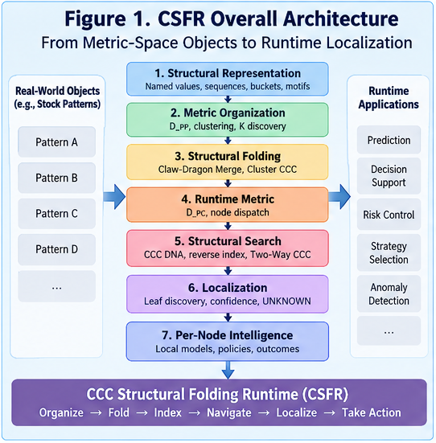

# CSFR-001 — From Metric Clusters to Structural Folding Runtime

## How Metric-Space Objects Become Folded CCC Structures for Runtime Localization

**CCC Structural Folding Runtime (CSFR)**
**CSFR-001**

---

## Abstract

Metric-space clustering can organize objects by similarity, but a cluster alone is not yet a runtime structure.

A cluster identifies a region of a metric space. It does not necessarily provide a reusable structural representation of that region, a metric interface for comparing new objects against the region, or a runtime mechanism for dispatching incoming objects through a hierarchical structural space.

This paper introduces the **CCC Structural Folding Runtime (CSFR)** as a general framework for transforming metric-space object collections into **folded CCC structures** that support runtime structural localization.

The central transformation is:

$$
\text{Objects}
\rightarrow
\text{Metric Space}
\rightarrow
\text{Clusters}
\rightarrow
\text{Structural Merge}
\rightarrow
\text{Cluster CCCs}
\rightarrow
\text{CCC Metric}
\rightarrow
\text{Runtime Localization}
$$

The key distinction is:

> **A cluster is not yet a runtime structure.**

CSFR introduces an additional structural folding step in which the members of a cluster are merged into a **Cluster CCC**: a policy-controlled structural representation of the cluster.

Unlike a conventional centroid, the Cluster CCC need not collapse the cluster into a single average object. It may preserve multiple structural alternatives, distributions, sequence motifs, categorical states, bucketed numeric values, and other reusable structural evidence.

Once a compatible **object-to-CCC distance function** is defined, the resulting CCCs can serve directly as runtime dispatch structures.

An incoming object can then be localized by repeatedly comparing it with child-node CCCs until it reaches an appropriate structural leaf.

CSFR therefore connects four previously separable operations:

**metric organization, structural folding, CCC representation, and runtime localization.**

The framework is domain-independent. Stock-market structural folding provides an important canonical application, but CSFR itself applies to any domain in which objects can be represented structurally, compared in a metric space, clustered, folded into reusable CCCs, and localized at runtime.

---

# 1. The Missing Step Between Clustering and Runtime Intelligence

Clustering is one of the most widely used mechanisms for organizing complex data.

Given a set of objects

$$
X=\{x_1,x_2,\ldots,x_m\},
$$

and a distance function

$$
d(x_i,x_j),
$$

a clustering algorithm partitions the objects into groups:

$$
X
\rightarrow
\{C_1,C_2,\ldots,C_k\}.
$$

Objects within the same cluster are expected to be closer to one another than to objects in other clusters.

This is useful.

But it leaves an important engineering question unanswered:

> **What exactly should represent each cluster after clustering is complete?**

A cluster is still a collection:

$$
C_i=\{x_{i1},x_{i2},\ldots,x_{in}\}.
$$

A runtime system receiving a new object \(x\) cannot efficiently reason with a historical collection merely because that collection has been labeled as a cluster.

The system still needs to determine:

1. what structural information from the cluster should be retained;
2. how that information should be compressed;
3. how uncertainty and structural alternatives should be represented;
4. how a new object should be compared with the cluster;
5. how clusters should participate in hierarchical dispatch;
6. how the resulting structure can support runtime localization.

CSFR addresses this missing layer.

---

# 2. Cluster Is Not Runtime Structure

A useful distinction is:

$$
\boxed{
\text{Cluster}
\neq
\text{Runtime Structure}
}
$$

A cluster answers primarily:

> Which historical objects belong together?

A runtime structure must additionally answer:

> How should a new object interact with this organized knowledge?

This difference is fundamental.

Consider a cluster containing many structurally related sequences.

The clustering operation may tell us that these sequences belong together.

But at runtime, we need something more compact and operational than the original sequence collection.

We need a representation that can function as a structural interface:

$$
\text{Cluster}
\rightarrow
\text{Reusable Structural Representation}.
$$

CSFR calls this representation a **Cluster CCC**.

The transformation is:

$$
C_i
\xrightarrow{\text{Structural Merge}}
CCC_i.
$$

The CCC becomes the runtime-facing structural representation of the cluster.

---

# 3. From Metric Organization to Structural Folding

CSFR separates the process into several conceptual stages.

```text
Objects
   ↓
Structural Representation
   ↓
Metric Distance
   ↓
Metric-Space Clustering
   ↓
Structural Merge
   ↓
Cluster CCC
   ↓
CCC-Compatible Distance
   ↓
Runtime Dispatch
   ↓
Structural Localization
```

The first half organizes historical objects.

The second half turns that organization into executable structural infrastructure.

This distinction can be summarized as:

$$
\text{Metric Organization}
\rightarrow
\text{Structural Folding}
\rightarrow
\text{Runtime Localization}.
$$

Clustering discovers neighborhoods.

Structural folding creates reusable representations of those neighborhoods.

Runtime localization uses those representations to place new objects into the folded structural space.

---



---

# 4. Structural Representation Before Clustering

CSFR assumes that an object can be expressed through a structured representation.

A generic representation may contain heterogeneous dimensions such as:

```text
named numeric values
named categorical values
numeric sequences
categorical sequences
bucketed values
local sequence motifs
bigrams
trigrams
domain-specific structural attributes
```

For example:

```text
Object
├── NumericAttributeA = 23.12
├── CategoryB         = STRONG
├── NumericSequenceC  = [12.1, 23.5, 6.0]
└── StateSequenceD    = [UP, UP, DOWN]
```

Different dimensions may use different distance functions.

A composite metric can then combine them:

$$
D(x,y) =
\sum_{r=1}^{R}
w_rD_r(x,y),
$$

subject, where appropriate, to

$$
w_r\geq0
$$

and

$$
\sum_{r=1}^{R}w_r=1.
$$

This allows heterogeneous structural evidence to coexist in one metric-space representation.

The exact representation and metric functions are domain-dependent.

The CSFR requirement is more general:

> Objects must expose enough structural information for meaningful similarity, clustering, folding, and later localization.

---

# 5. Metric-Space Clustering

Once objects can be compared, conventional or specialized metric-space clustering algorithms can organize them.

A possible pipeline is:

```text
Pairwise Metric Relationships
        ↓
Nearest-Object / Nearest-Cluster Analysis
        ↓
Candidate Cluster Structure
        ↓
K Estimation
        ↓
Metric-Space K-Means or Related Clustering
```

CSFR does not require one universal clustering algorithm.

Possible methods include:

* K-Means or metric-compatible variants;
* hierarchical clustering;
* nearest-pair merging;
* threshold-based clustering;
* policy-driven clustering;
* domain-specific structural clustering.

The important point is that clustering is **not the end of the folding process**.

It provides the material from which the next structural representation is constructed.

---

# 6. Structural Merge

For each cluster

$$
C_i=\{x_{i1},x_{i2},\ldots,x_{in}\},
$$

CSFR applies a structural merge operator:

$$
M_\pi(C_i)
\rightarrow
CCC_i,
$$

where \(\pi\) represents the merge policy.

The merge policy determines which structures are retained, compressed, weighted, filtered, or discarded.

Therefore:

$$
CCC_i =
M_\pi(C_i).
$$

This is the central folding operation of CSFR.

The purpose is not merely data reduction.

The purpose is to construct a representation that preserves the structural information required for future runtime comparison.

---

# 7. Cluster CCC Is Not a Centroid

A conventional centroid typically attempts to represent a cluster using a central or average point:

$$
\mu_i =
\frac{1}{|C_i|}
\sum_{x\in C_i}x.
$$

This is powerful when averaging is meaningful.

But many structural spaces cannot be adequately represented by a single averaged object.

Suppose one sequence position in a cluster contains:

```text
UP      0.51
DOWN    0.45
FLAT    0.04
```

A winner-take-all representation might reduce this to:

```text
UP
```

An averaging procedure may produce something with little direct structural meaning.

A CCC can instead retain:

```text
UP      0.51
DOWN    0.45
```

after policy-driven filtering.

The resulting representation explicitly preserves an important fact:

> The cluster contains two major structural possibilities at this position.

This motivates one of the central CSFR claims:

$$
\boxed{
\text{Cluster CCC is not merely a centroid.}
}
$$

More precisely:

> **A Cluster CCC is a policy-compressed structural possibility set.**

This distinction is especially important when the source cluster contains categorical alternatives, sequence motifs, multimodal behavior, or uncertainty that should survive folding.

---

# 8. Folding Without Unnecessary Destruction

Structural folding necessarily compresses information.

The engineering question is not whether information is removed.

It is:

> **Which information may safely be removed without destroying the structure needed by downstream runtime operations?**

CSFR therefore treats folding as policy-controlled compression:

$$
C_i
\xrightarrow{M_\pi}
CCC_i.
$$

Different policies may produce different CCCs from the same cluster.

A strict policy may retain only dominant structures.

A permissive policy may preserve several alternatives.

A confidence-aware policy may retain alternatives until their accumulated weight exceeds a threshold.

For example:

```text
Position j

Original distribution:

A    0.52
B    0.31
C    0.12
D    0.05
```

A policy may retain:

```text
A    0.52
B    0.31
C    0.12
```

while removing:

```text
D    0.05
```

The result is neither the complete historical cluster nor a single average point.

It is a controlled fold.

---

# 9. A Special Case: Aligned Sequence Clusters

Sequence data introduces a difficult general structural-merge problem.

Sequences may differ in:

* length;
* alignment;
* branching;
* missing elements;
* local ordering;
* structural correspondence.

This general family of problems can produce what DBM-SI research describes as the **Claw-Dragon Merge** problem: many structural elements must be merged without destroying their relationships.

However, an important special case exists.

Suppose every sequence in a cluster has exactly the same length:

$$
|S_i|=n
$$

for all \(S_i\), and positions are semantically aligned:

$$
S_i[j]\leftrightarrow S_k[j].
$$

Then the general sequence merge can collapse into a much simpler operation:

$$
CCC_C =
[P_0,P_1,\ldots,P_{n-1}],
$$

where each \(P_j\) is a weighted set of structural values observed at position \(j\):

$$
P_j =
\{(v_1,w_1),(v_2,w_2),\ldots\}.
$$

The construction becomes approximately:

```text
collect values per position
        ↓
count / weight
        ↓
normalize
        ↓
sort
        ↓
policy-driven filtering
        ↓
Position CCC
        ↓
Sequence Cluster CCC
```

This is a major simplification.

A difficult general structural merge becomes a tractable **per-position distribution merge**.

The detailed algorithm is developed separately in CSFR-003.

---

# 10. From Cluster CCC to CCC Metric

Constructing a CCC is only half of the runtime problem.

The next requirement is a compatible distance function:

$$
D_{PC}(x,CCC_i).
$$

This differs from the original object-to-object distance:

$$
D_{PP}(x_i,x_j).
$$

The distinction should be explicit:

$$
\boxed{
D_{PP}
:
Pattern/Object
\leftrightarrow
Pattern/Object
}
$$

versus

$$
\boxed{
D_{PC}
:
Pattern/Object
\leftrightarrow
Cluster\ CCC
}
$$

The first supports operations such as:

```text
clustering
nearest-pair discovery
cluster formation
K estimation
```

The second supports:

```text
runtime comparison
child-node selection
structural localization
leaf discovery
```

A third metric may also become useful:

$$
D_{CC}(CCC_i,CCC_j),
$$

supporting relationships between folded structures themselves.

Thus CSFR naturally exposes a metric triad:

$$
\boxed{
D_{PP},\quad D_{PC},\quad D_{CC}
}
$$

corresponding to:

```text
Object ↔ Object
Object ↔ CCC
CCC    ↔ CCC
```

---

# 11. Distance to a Structural Possibility Set

Because a CCC may retain several possible values at a structural position, object-to-CCC distance is not necessarily a conventional point-to-point distance.

Suppose the target object contains value \(x_j\) at position \(j\), while the CCC contains:

$$
P_j =
\{(v_1,p_1),(v_2,p_2),\ldots,(v_q,p_q)\}.
$$

A simple consensus distance may be defined as:

$$
d_j(x_j,P_j) =
\sum_{r=1}^{q}
p_r d(x_j,v_r).
$$

The complete sequence distance may then be:

$$
D(x,CCC) =
\frac{
\sum_j w_jd_j(x_j,P_j)
}{
\sum_jw_j
}.
$$

This allows the incoming object to be compared against a **distribution of structural possibilities**, rather than against a single artificial average.

More sophisticated policies may use:

* minimum distance;
* weighted mean distance;
* trimmed distance;
* confidence-aware distance;
* thresholded candidate distance;
* domain-specific consensus functions.

The important principle is:

> **The metric should respect the information preserved by the fold.**

---

# 12. CCC as a Runtime Interface

Once a Cluster CCC and compatible metric exist, the CCC becomes operational.

Consider a tree node with child CCCs:

$$
CCC_1,CCC_2,\ldots,CCC_k.
$$

For an incoming object \(x\), calculate:

$$
D_{PC}(x,CCC_1),
D_{PC}(x,CCC_2),
\ldots,
D_{PC}(x,CCC_k).
$$

A dispatch policy then selects the next structural region:

$$
Child(x) =
Policy(
D_{PC}(x,CCC_1),
\ldots,
D_{PC}(x,CCC_k)
).
$$

The simplest policy may be:

$$
Child(x) =
\arg\min_iD_{PC}(x,CCC_i).
$$

But CSFR does not require winner-take-all dispatch.

A runtime policy may instead support:

```text
Top-1 dispatch
Top-N candidate dispatch
threshold dispatch
ambiguity-preserving dispatch
fallback dispatch
unknown-pattern rejection
two-phase search
```

This is particularly important in open or evolving domains.

A runtime should not necessarily force every new object into an existing historical structure.

---

# 13. Structural Localization

Repeated CCC dispatch produces structural localization.

```text
Incoming Object
      ↓
Root
      ↓
Child CCC Comparison
      ↓
Selected Structural Region
      ↓
Child CCC Comparison
      ↓
...
      ↓
Structural Leaf
```

Formally:

$$
x
\rightarrow
N_0
\rightarrow
N_1
\rightarrow
\cdots
\rightarrow
N_L.
$$

The leaf \(N_L\) identifies a localized structural regime.

This gives CSFR its central runtime capability:

$$
\boxed{
\text{Object}
\rightarrow
\text{Structural Localization}
}
$$

Localization can then support downstream intelligence.

For example:

```text
localized structural regime
        ↓
historical outcomes
specialized models
domain policies
local statistics
local predictors
local rules
local agents
Per-Node Intelligence
```

Thus CSFR itself need not solve every downstream task.

Its responsibility is to place the incoming object into an appropriate structural context.

---

# 14. Localization Before Prediction

This distinction is especially important in predictive domains.

A conventional system may attempt:

$$
x
\rightarrow
Prediction.
$$

CSFR introduces an intermediate structural layer:

$$
x
\rightarrow
Structural\ Localization
\rightarrow
Local\ Intelligence
\rightarrow
Prediction/Decision.
$$

The difference is substantial.

Instead of asking one global model to directly interpret every possible condition, the runtime first asks:

> **Where in the folded structural space does this object belong?**

Only then does local intelligence operate.

This produces the broader architecture:

$$
\boxed{
Localization
+
Per\text{-}Node\ Intelligence
}
$$

which separates structural navigation from specialized local computation.

---

# 15. CCC DNA and Reverse Structural Access

A Cluster CCC can also expose reusable structural components such as:

```text
bucketed numeric values
categorical states
named attributes
bigrams
trigrams
sequence motifs
structural signatures
```

These components may be treated as a form of **CCC DNA**.

The conventional direction is:

$$
Object
\rightarrow
Metric
\rightarrow
CCC.
$$

CCC DNA enables a complementary direction:

$$
Observed\ Structural\ Features
\rightarrow
Candidate\ CCCs.
$$

Together they enable a Two-Way CCC mechanism:

```text
Object
   ↓
Metric Dispatch
   ↓
CCC

and

Structural DNA
   ↓
Reverse Index
   ↓
Candidate CCC
```

This can support a two-phase runtime:

$$
DNA\ Retrieval
\rightarrow
Candidate\ CCCs
\rightarrow
Full\ Metric\ Verification.
$$

The detailed mechanism is developed in CSFR-005.

---

# 16. Offline Folding and Online Localization

CSFR naturally separates into two major operational phases.

## 16.1 Offline Structural Folding

```text
Historical / Training Objects
        ↓
Structural Representation
        ↓
Metric Construction
        ↓
Clustering
        ↓
Structural Merge
        ↓
Cluster CCC Construction
        ↓
CCC Tree / Index Construction
```

The result is a folded structural space.

---

## 16.2 Online Runtime Localization

```text
Incoming Object
        ↓
Structural Encoding
        ↓
Candidate Retrieval
        ↓
CCC Metric
        ↓
Node Dispatch
        ↓
Repeated Localization
        ↓
Structural Leaf
        ↓
Per-Node Intelligence
```

The relationship is:

$$
Offline\ Folding
\rightarrow
Online\ Localization.
$$

This is one of the fundamental architectural principles of CSFR.

---

# 17. Folding as Runtime Compilation

Another useful interpretation is to treat structural folding as a form of compilation.

Historical objects may be large, redundant, and expensive to search directly.

The folding process converts them into runtime structures:

$$
Historical\ Structural\ Space
\xrightarrow{Fold}
CCC\ Runtime\ Space.
$$

In this interpretation:

```text
Raw Objects          → source material
Metric Clustering    → structural organization
CCC Merge            → structural compilation
CCC Tree             → executable structural index
Localization         → runtime execution
```

This perspective explains why clustering alone is insufficient.

A cluster is discovered structure.

A CCC is **runtime-ready folded structure**.

---

# 18. Structural Folding as Knowledge Compression

CSFR can also be interpreted as a knowledge-compression system.

Suppose a domain contains millions of historical objects.

A brute-force runtime might compare every incoming object against a large fraction of those historical objects:

$$
O(N)
$$

or worse under more complex comparisons.

Structural folding attempts to replace this with:

$$
N\ Historical\ Objects
\rightarrow
K\ CCCs
\rightarrow
Hierarchical\ Localization.
$$

The goal is not merely computational acceleration.

The deeper objective is:

> **Compress repeated structural experience into reusable navigational knowledge.**

The CCC therefore functions simultaneously as:

* a folded representation;
* a metric target;
* a dispatch handle;
* a structural summary;
* a reusable runtime primitive.

---

# 19. CSFR and Uncertainty-Preserving Folding

A structural fold can be overly destructive.

For example:

```text
Cluster:
A 51%
B 45%
C  4%
```

A single-label fold:

```text
A
```

loses the important competition between A and B.

A policy-controlled CCC can retain:

```text
A 51%
B 45%
```

and therefore preserve part of the uncertainty present in the original cluster.

CSFR does not claim that every CCC automatically preserves all uncertainty.

Rather:

> **CCC representation creates an engineering mechanism through which selected uncertainty can survive structural folding.**

This provides a concrete runtime connection to the broader distinction between destructive folding and uncertainty-preserving folding.

The amount of uncertainty retained remains a policy decision.

---

# 20. Runtime-Oriented Clustering

CSFR also changes how clustering quality may be evaluated.

Traditional clustering metrics may optimize:

* within-cluster distance;
* between-cluster separation;
* silhouette score;
* variance reduction.

These remain useful.

But a structural runtime introduces another criterion:

> **Does the resulting cluster structure produce stable and useful runtime localization?**

Therefore the best \(K\) is not necessarily the \(K\) that optimizes clustering geometry alone.

It may instead be the value that produces the best downstream structural runtime.

Possible criteria include:

```text
CCC stability
dispatch stability
localization confidence
leaf coherence
unknown-pattern rejection quality
downstream Per-Node Intelligence performance
runtime cost
```

This leads to an important shift:

$$
Clustering\ Quality
\rightarrow
Runtime\ Structural\ Quality.
$$

CSFR therefore treats clustering as part of a larger runtime design problem.

---

# 21. Generality Beyond Stock-Market Patterns

Stock-market structural folding provides a particularly useful canonical case because fixed-window market patterns can often be represented as equal-length aligned sequences.

This simplifies sequence CCC construction substantially.

However, the CSFR abstraction is not stock-specific.

The generic framework is:

$$
\boxed{
Objects
\rightarrow
Metric
\rightarrow
Clusters
\rightarrow
Structural\ Merge
\rightarrow
CCC
\rightarrow
Localization
}
$$

Potential object domains include:

```text
financial patterns
machine telemetry
behavioral trajectories
software execution traces
sensor sequences
industrial operating regimes
biological signals
network activity
robot trajectories
event streams
structured documents
agent behavior patterns
```

Each domain may require different representations, metrics, merge policies, and CCC structures.

The runtime architecture remains reusable.

---

# 22. CSFR as a Structural Intelligence Runtime Primitive

CSFR should therefore not be understood merely as another clustering method.

Its contribution lies in connecting multiple operations into one reusable runtime chain:

$$
Metric
\rightarrow
Cluster
\rightarrow
Merge
\rightarrow
CCC
\rightarrow
CCC\ Metric
\rightarrow
Localization.
$$

Each component may already exist independently in different forms.

The architectural contribution is their integration around a specific runtime question:

> **How does a set of metric-space objects become a folded CCC structure that can support runtime localization?**

CSFR answers:

1. represent objects structurally;
2. define compatible metric distances;
3. organize the metric space into clusters;
4. structurally merge each cluster;
5. construct a policy-controlled Cluster CCC;
6. define object-to-CCC distance;
7. organize CCCs into runtime dispatch structures;
8. localize incoming objects through those structures;
9. attach specialized intelligence to localized nodes when needed.

The result is not merely a model.

It is a **structural runtime**.

---

# 23. Canonical CSFR Pipeline

The canonical CSFR pipeline can be summarized as:

```text
                 METRIC-SPACE OBJECTS
                         │
                         ▼
              Structural Representation
                         │
                         ▼
                 Object Metric
                       D_PP
                         │
                         ▼
              Metric-Space Clustering
                         │
                         ▼
                Structural Merge
                         │
                         ▼
                   Cluster CCC
                         │
              ┌──────────┴──────────┐
              │                     │
              ▼                     ▼
         CCC Metric              CCC DNA
            D_PC                    │
              │                Reverse Index
              │                     │
              └──────────┬──────────┘
                         ▼
                 Runtime Dispatch
                         │
                         ▼
              Structural Localization
                         │
                         ▼
                  Structural Leaf
                         │
                         ▼
               Per-Node Intelligence
```

This pipeline defines the core scope of CSFR.

---

# 24. Three Metric Relationships

A mature CSFR implementation may expose three related but distinct metric interfaces:

```text
D_PP
Object  ↔ Object

D_PC
Object  ↔ Cluster CCC

D_CC
CCC     ↔ CCC
```

Their responsibilities differ.

### D_PP — Object-to-Object

Used for:

```text
clustering
nearest-pair analysis
cluster discovery
K estimation
```

### D_PC — Object-to-CCC

Used for:

```text
runtime dispatch
localization
candidate verification
leaf selection
```

### D_CC — CCC-to-CCC

Potentially used for:

```text
CCC organization
hierarchical CCC construction
structural evolution
cluster merging
cross-cluster comparison
runtime reorganization
```

This metric triad provides a useful interface boundary for future CSFR implementations.

---

# 25. Core Claims

CSFR makes the following core claims.

### Claim 1 — Clustering is not sufficient for runtime structural intelligence.

A cluster identifies a neighborhood but does not automatically provide a reusable runtime representation.

---

### Claim 2 — Cluster-to-CCC structural merge provides the missing folding layer.

$$
Cluster
\rightarrow
CCC
$$

converts discovered metric organization into reusable structural knowledge.

---

### Claim 3 — A Cluster CCC need not be a centroid.

It may preserve multiple structural alternatives and therefore function as a policy-compressed structural possibility set.

---

### Claim 4 — CCC-compatible metrics convert folded structures into runtime interfaces.

$$
Object
\leftrightarrow
CCC
$$

enables direct structural dispatch.

---

### Claim 5 — Hierarchical CCC dispatch enables runtime localization.

$$
Object
\rightarrow
Node
\rightarrow
Node
\rightarrow
Leaf
$$

places incoming objects into a folded structural space.

---

### Claim 6 — Localization and local intelligence should be separable.

$$
Localization
+
Per\text{-}Node\ Intelligence
$$

allows structural navigation and specialized computation to evolve independently.

---

### Claim 7 — CCC DNA can provide reverse structural access.

$$
Structural\ Evidence
\rightarrow
Candidate\ CCC
$$

complements metric dispatch and enables Two-Way CCC search.

---

### Claim 8 — Structural folding can preserve selected uncertainty.

Policy-controlled CCC construction can retain significant alternatives instead of collapsing every cluster into one representative value.

---

# 26. What CSFR Is Not

CSFR is not:

```text
a universal clustering algorithm
a stock-price predictor
a replacement for all embedding methods
a claim that every metric space should use K-Means
a claim that every cluster should use the same merge policy
a requirement that every CCC be sequence-based
a requirement that runtime dispatch always use winner-take-all
```

CSFR is a structural runtime framework.

Its purpose is to provide reusable interfaces between:

```text
metric organization
structural folding
CCC representation
runtime localization
local intelligence
```

---

# 27. Research and Engineering Questions

The framework immediately exposes several research directions.

### Representation

What structural dimensions should be preserved before clustering?

### Metric Design

How should heterogeneous numeric, categorical, and sequential distances be combined?

### Cluster Discovery

Should \(K\) be fixed, inferred geometrically, or optimized for downstream runtime behavior?

### Structural Merge

Which cluster structures should survive folding?

### Uncertainty

How much structural ambiguity should the CCC preserve?

### CCC Metric

What is the best consensus distance between an object and a structural possibility set?

### Dispatch

When should the runtime use Top-1, Top-N, threshold, or ambiguity-preserving routing?

### Unknown Structures

How should the system recognize that an incoming object does not belong to any existing CCC?

### Structural Evolution

When should existing CCCs split, merge, decay, or grow?

### Per-Node Intelligence

What intelligence should be attached to a localized structural region?

These questions transform CSFR from a static representation scheme into a broader structural-runtime research program.

---

# 28. Relationship to Structural Intelligence

CSFR occupies a specific position in a broader Structural Intelligence stack.

```text
Structural Representation
        ↓
Metric Organization
        ↓
Structural Folding
        ↓
CCC Runtime
        ↓
Structural Localization
        ↓
Per-Node Intelligence
        ↓
Domain Application
```

Its primary responsibility is the middle:

$$
\boxed{
Structural\ Folding
\rightarrow
CCC\ Runtime
\rightarrow
Localization
}
$$

This makes CSFR a bridge between structural knowledge organization and runtime intelligence.

---

# 29. Closing Perspective

Large object spaces are easy to collect and increasingly easy to embed.

They are much harder to organize into reusable runtime knowledge.

Clustering is an important step, but clustering alone does not complete the transformation.

CSFR proposes the additional chain:

$$
\boxed{
Metric\ Cluster
\rightarrow
Structural\ Merge
\rightarrow
Cluster\ CCC
\rightarrow
CCC\ Metric
\rightarrow
Runtime\ Localization
}
$$

The central idea is simple:

> **Do not stop after discovering clusters. Fold them into structures that can run.**

A Cluster CCC turns a historical neighborhood into a reusable structural interface.

A CCC metric makes that interface searchable.

A dispatch tree makes it navigable.

Structural localization makes it operational.

Per-Node Intelligence can then make it intelligent.

Thus:

$$
\boxed{
Data
\rightarrow
Structure
\rightarrow
Folded\ Structure
\rightarrow
Localization
\rightarrow
Intelligence
}
$$

This is the central runtime path of **CCC Structural Folding Runtime (CSFR)**.

---

## Next

**CSFR-002 — Metric Representation and Composite Structural Distance**

The next paper develops the metric foundation of CSFR, including heterogeneous named attributes, numeric bucketing, sequence representation, bigram/trigram structural features, directional sequence descriptors, and composite structural distance.

---

**CCC Structural Folding Runtime (CSFR)**
*From Metric-Space Objects to Runtime Localization*
