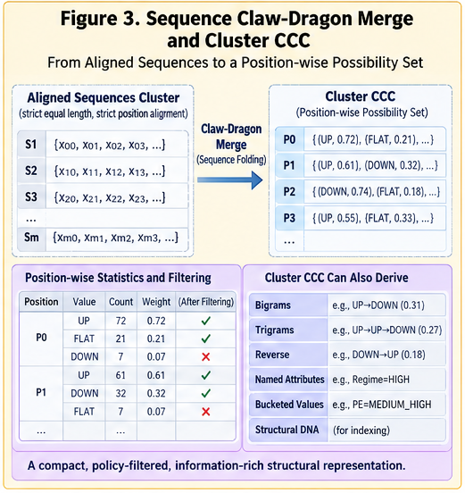
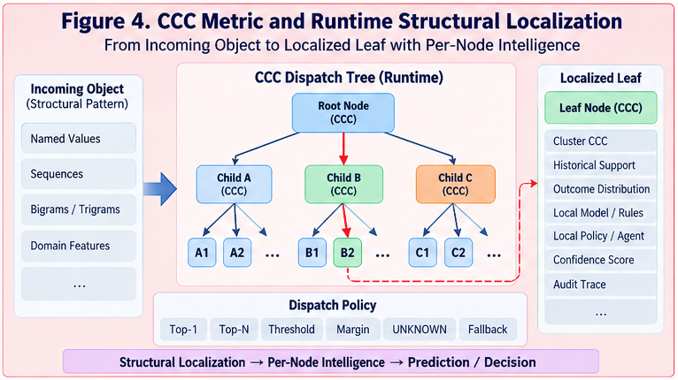

# CSFR-003 — Sequence Claw-Dragon Merge and Cluster CCC

## From Aligned Sequence Clusters to Policy-Compressed Structural Possibility Sets

**CCC Structural Folding Runtime (CSFR)**
**CSFR-003**

---

## Abstract

Metric-space clustering identifies groups of structurally related objects, but clustering alone does not produce a runtime-ready representation of those groups.

CCC Structural Folding Runtime (CSFR) introduces a structural merge step:

$$
Cluster
\rightarrow
Cluster\ CCC.
$$

This paper develops that step for sequence clusters.

General sequence merging is difficult because sequences may differ in length, alignment, branching, missing elements, local correspondence, and structural order. CSFR refers to this family of problems as the **Claw-Dragon Merge** problem: many structural “claws” must be merged without destroying the relationships that make the structure meaningful.

A highly useful special case occurs when every sequence in a cluster has:

$$
\text{equal length}
$$

and

$$
\text{strict positional alignment}.
$$

Under these constraints, the general structural merge collapses into a much simpler form:

$$
\text{Sequence Cluster}
\rightarrow
\text{Per-Position Structural Distributions}
\rightarrow
\text{Policy Filtering}
\rightarrow
\text{Sequence Cluster CCC}.
$$

For a cluster \(C\) containing aligned sequences of length \(n\), the resulting CCC can be represented as:

$$
CCC_C =
[P_0,P_1,\ldots,P_{n-1}],
$$

where each position \(P_j\) contains a weighted set of candidate values:

$$
P_j =
\{(v_1,w_1),(v_2,w_2),\ldots\}.
$$

This representation differs fundamentally from a centroid.

A centroid attempts to produce one representative point.

A Cluster CCC can retain multiple significant structural alternatives.

Therefore:

> **A Cluster CCC is not merely a centroid. It is a policy-compressed structural possibility set.**

This property allows selected uncertainty, multimodality, local alternatives, and structural ambiguity to survive the folding operation.

The resulting CCC becomes the folded representation used by later CSFR stages for object-to-CCC distance, runtime dispatch, and structural localization.

---



---

# 1. The Structural Merge Problem

Suppose metric-space clustering produces:

$$
C =
\{x_1,x_2,\ldots,x_m\}.
$$

The cluster tells us that these objects belong together under some structural metric.

But the runtime still needs a compact representation of the cluster.

The simplest possible strategy is:

```text
store all cluster members
```

This preserves information but provides little folding.

Another strategy is:

```text
calculate one centroid
```

This is compact but may destroy important structure.

CSFR therefore introduces a third option:

$$
Cluster
\xrightarrow{\text{Structural Merge}}
CCC.
$$

The objective is to compress the cluster while preserving the structures required by later localization.

---

# 2. Why General Sequence Merge Is Difficult

Consider three sequences:

```text
A = [a, b, c, d]

B = [a, x, y, d]

C = [q, b, z]
```

Several questions arise immediately:

* Is `A[1]` structurally comparable with `B[1]`?
* Is `C[1]` aligned with `A[1]` or `A[2]`?
* Should missing positions be treated as absence or as structural variation?
* Are multiple branches required?
* Is sequence order preserved?
* Can local subsequences be merged independently?
* Should different paths survive as alternatives?

A general merge therefore contains both **content correspondence** and **structural correspondence** problems.

This is substantially harder than averaging aligned vectors.

---

# 3. The Claw-Dragon Metaphor

CSFR uses the term **Claw-Dragon Merge** for the general structural situation in which many candidate substructures must be merged into one reusable representation.

The metaphor emphasizes that the merge may involve many interacting “claws”:

```text
Sequence A ────────┐
                   ├── structural merge
Sequence B ────────┤
                   ├── branching
Sequence C ────────┤
                   ├── correspondence
Sequence D ────────┘
```

The problem becomes difficult when:

```text
length differs
position differs
ordering differs
branching differs
substructure differs
missing values occur
local alignments disagree
```

The fully general problem may require sophisticated graph-like or alignment-aware structural merge mechanisms.

CSFR does not attempt to solve every form of Claw-Dragon Merge in this paper.

Instead, it identifies an important special case where the problem collapses dramatically.

---

# 4. The Equal-Length Aligned Special Case

Assume a cluster contains:

$$
C =
\{
S_1,S_2,\ldots,S_m
\}.
$$

Each sequence has identical length:

$$
|S_i|=n
\quad
\forall i.
$$

And every sequence position has the same structural meaning:

$$
S_i[j]
\leftrightarrow
S_k[j].
$$

Then:

```text
position 0 ↔ position 0
position 1 ↔ position 1
...
position n-1 ↔ position n-1
```

No sequence alignment search is required.

No dynamic correspondence problem is required.

No branch-matching problem is required.

The merge becomes:

$$
\boxed{
\text{Per-Position Structural Merge}
}
$$

This is a major simplification.

---

# 5. Sequence Cluster Definition

Let the cluster be:

$$
C=
\{
[x_{00},x_{01},\ldots,x_{0,n-1}],
[x_{10},x_{11},\ldots,x_{1,n-1}],
\ldots,
[x_{m-1,0},x_{m-1,1},\ldots,x_{m-1,n-1}]
\}.
$$

For each position \(j\), collect:

$$
V_j =
\{
x_{0j},
x_{1j},
\ldots,
x_{m-1,j}
\}.
$$

The entire merge problem can then be decomposed into \(n\) independent positional merges.

---

# 6. Per-Position Value Counting

For each position \(j\), count all observed values.

Example:

```text
Position 3

UP
UP
DOWN
UP
FLAT
DOWN
UP
```

Counts become:

```text
UP      4
DOWN    2
FLAT    1
```

Let:

$$
count_j(v)
$$

denote the count of value \(v\) at position \(j\).

Then:

$$
\sum_v count_j(v)=m.
$$

---

# 7. Convert Counts to Weights

Counts can be normalized:

$$
w_j(v) =
\frac{count_j(v)}{m}.
$$

For the previous example:

```text
UP      0.5714
DOWN    0.2857
FLAT    0.1429
```

The positional representation becomes:

$$
P_j =
\{
(UP,0.5714),
(DOWN,0.2857),
(FLAT,0.1429)
\}.
$$

This is the raw positional CCC candidate.

---

# 8. Sequence Cluster CCC

The complete sequence CCC is:

$$
CCC_C =
[P_0,P_1,\ldots,P_{n-1}].
$$

Each \(P_j\) is a weighted structural possibility set.

Formally:

$$
P_j =
\{
(v,w_j(v))
\mid
v\in V_j
\}.
$$

Thus:

$$
CCC_C =
[
\{(v,w_0(v))\},
\{(v,w_1(v))\},
\ldots
].
$$

The representation preserves variation position by position.

---

# 9. A Concrete Example

Suppose a cluster contains:

```text
S1 = [UP,   UP,   DOWN]
S2 = [UP,   FLAT, DOWN]
S3 = [UP,   UP,   DOWN]
S4 = [FLAT, UP,   FLAT]
```

Then:

## Position 0

```text
UP      3
FLAT    1
```

Normalized:

```text
UP      0.75
FLAT    0.25
```

## Position 1

```text
UP      3
FLAT    1
```

Normalized:

```text
UP      0.75
FLAT    0.25
```

## Position 2

```text
DOWN    3
FLAT    1
```

Normalized:

```text
DOWN    0.75
FLAT    0.25
```

Therefore:

```text
CCC_C

P0 = {UP:0.75,   FLAT:0.25}
P1 = {UP:0.75,   FLAT:0.25}
P2 = {DOWN:0.75, FLAT:0.25}
```

The cluster has been folded without collapsing all variation.

---

# 10. The Core Data Structure

A practical implementation can use:

```java
class SequenceClusterCCC {

    List<PositionCCC> positions;

}
```

with:

```java
class PositionCCC {

    int position;

    List<ValueWeight> candidates;

}
```

and:

```java
class ValueWeight {

    String value;

    double weight;

}
```

Conceptually:

```text
SequenceClusterCCC
├── Position 0
│   ├── UP    0.75
│   └── FLAT  0.25
│
├── Position 1
│   ├── UP    0.75
│   └── FLAT  0.25
│
└── Position 2
    ├── DOWN  0.75
    └── FLAT  0.25
```

This representation is explicit and auditable.

---

# 11. Why a Flat Pair List Is Not Enough

A flat structure such as:

```java
List<Pair<String, Double>>
```

may store candidate values and weights.

But sequence CCC semantics require explicit position.

Otherwise:

```text
UP 0.75
FLAT 0.25
DOWN 0.75
...
```

does not reveal which value belongs to which position.

Therefore the stronger representation is:

$$
Position
\rightarrow
Candidate\ Value\ Distribution.
$$

This keeps positional meaning intact.

---

# 12. Sorting

Within each position, candidate values can be sorted by descending weight.

Example:

```text
UP      0.52
DOWN    0.43
FLAT    0.05
```

Sorted representation:

```text
UP      0.52
DOWN    0.43
FLAT    0.05
```

Sorting provides:

* dominant-value visibility;
* deterministic representation;
* easier filtering;
* easier auditing;
* efficient top-N access.

---

# 13. Policy-Driven Filtering

Not every observed value needs to remain in the folded CCC.

Define a filtering policy:

$$
F_\pi(P_j)
\rightarrow
P'_j.
$$

Possible policies include:

```text
minimum weight
top-N
cumulative coverage
relative-to-top threshold
minimum count
domain whitelist
confidence threshold
```

The filtered sequence CCC becomes:

$$
CCC_C =
[
F_\pi(P_0),
F_\pi(P_1),
\ldots,
F_\pi(P_{n-1})
].
$$

---

# 14. Minimum-Weight Filtering

Suppose:

```text
UP      0.56
DOWN    0.31
FLAT    0.09
OTHER   0.04
```

With:

```text
minimumWeight = 0.10
```

the result becomes:

```text
UP      0.56
DOWN    0.31
```

The low-support alternatives are removed.

---

# 15. Top-N Filtering

A policy may retain only the top two candidates:

```text
UP      0.47
FLAT    0.39
DOWN    0.14
```

becomes:

```text
UP      0.47
FLAT    0.39
```

This keeps representation size bounded.

---

# 16. Cumulative-Coverage Filtering

Another useful policy is to retain values until cumulative weight exceeds a threshold.

Example:

```text
UP      0.42
DOWN    0.33
FLAT    0.17
OTHER   0.08
```

With:

```text
coverage = 0.80
```

retain:

```text
UP      0.42
DOWN    0.33
FLAT    0.17
```

because:

$$
0.42+0.33+0.17=0.92.
$$

This preserves enough probability mass without retaining every tail value.

---

# 17. Filtering Is Part of Folding

Filtering is not merely storage optimization.

It defines what structural possibilities survive the fold.

Therefore:

$$
CCC_C =
Fold_\pi(C).
$$

The policy \(\pi\) controls the information boundary.

This is why CCC folding is policy-driven.

---

# 18. Cluster CCC Is Not a Centroid

This distinction is central.

A centroid tries to produce one representative value per dimension.

For numeric vectors:

$$
\mu_j =
\frac{1}{m}
\sum_i x_{ij}.
$$

But for structural sequences, a single representative may be misleading.

Suppose one position contains:

```text
UP      0.51
DOWN    0.45
FLAT    0.04
```

A centroid-like reduction may produce:

```text
UP
```

or some artificial numeric average.

The CCC can instead preserve:

```text
UP      0.51
DOWN    0.45
```

This is structurally more informative.

---



---

# 19. Structural Possibility Set

CSFR therefore defines a Cluster CCC as:

> **A policy-compressed structural possibility set representing a cluster for future runtime comparison.**

Formally:

$$
CCC_C =
Fold_\pi(C).
$$

For sequences:

$$
CCC_C =
[
P'_0,P'_1,\ldots,P'_{n-1}
].
$$

Each \(P'_j\) may contain multiple significant structural alternatives.

---

# 20. Multimodality Survives Folding

Consider:

```text
Position 5

UP      0.48
DOWN    0.46
FLAT    0.06
```

This cluster is locally bimodal.

A one-value representative destroys that fact.

A CCC can retain:

```text
UP      0.48
DOWN    0.46
```

Therefore the folded representation preserves multimodality.

This can matter significantly during runtime localization.

---

# 21. Selected Uncertainty Preservation

The CCC also preserves selected uncertainty.

Suppose:

$$
P_j =
\{
(A,0.53),
(B,0.42),
(C,0.05)
\}.
$$

After filtering:

$$
P'_j =
\{
(A,0.53),
(B,0.42)
\}.
$$

The fold has compressed the cluster but retained its dominant ambiguity.

This is a lightweight form of uncertainty-preserving folding.

---

# 22. Uncertainty Preservation Is Policy-Dependent

CSFR does not claim that every fold preserves uncertainty automatically.

A strict policy may produce:

```text
A 0.53
```

A permissive policy may preserve:

```text
A 0.53
B 0.42
```

Therefore uncertainty preservation is controlled by:

$$
\pi.
$$

The runtime designer decides how much ambiguity should survive.

---

# 23. Structural Compression Ratio

Let:

$$
|C|
$$

represent the total number of source elements in the cluster.

Let:

$$
|CCC_C|
$$

represent the number of retained CCC candidates.

A simple compression ratio is:

$$
R_{compress} =
\frac{|CCC_C|}{|C|}.
$$

A smaller ratio means stronger compression.

But stronger compression is not automatically better.

The objective is:

$$
Compression
\quad
\text{without destructive structural loss}.
$$

---

# 24. Fold Quality

A good fold should balance:

$$
Compactness
\leftrightarrow
Structural\ Fidelity.
$$

Potential fold-quality measures include:

```text
retained probability mass
reconstruction error
dispatch stability
cluster-member-to-CCC distance
runtime localization accuracy
candidate-count reduction
structural ambiguity retention
```

The best CCC is therefore not necessarily the smallest CCC.

---

# 25. Sequence-Level Policy

Filtering may also apply at the sequence level.

For example:

```text
Position 0 keeps Top-1
Position 1 keeps Top-2
Position 2 keeps 90% cumulative coverage
```

This may be useful if different positions have different structural roles.

Thus:

$$
\pi =
\{\pi_0,\pi_1,\ldots,\pi_{n-1}\}.
$$

The folding policy can be position-specific.

---

# 26. Position Importance

Some sequence positions may be more important than others.

A CCC may therefore store positional importance:

```java
class PositionCCC {

    int position;

    double positionWeight;

    List<ValueWeight> candidates;

}
```

This weight later participates in object-to-CCC distance.

The merge stage therefore can preserve not only candidate values, but also position semantics.

---

# 27. Numeric Sequence CCC

The same concept applies to numeric sequences.

Suppose a position contains:

```text
10.1
10.4
10.5
15.0
```

Several strategies are possible.

---

# 28. Numeric Bucketing Before Merge

One strategy is:

```text
10.1 → LOW
10.4 → LOW
10.5 → LOW
15.0 → HIGH
```

Then merge categorical bucket states:

```text
LOW     0.75
HIGH    0.25
```

This is simple and structurally interpretable.

---

# 29. Numeric Candidate Ranges

Another strategy is to preserve ranges:

```text
[10.0,10.7]    0.75
[14.5,15.5]    0.25
```

Then a Position CCC becomes:

$$
P_j =
\{
(range_1,w_1),
(range_2,w_2)
\}.
$$

This supports numeric multimodality.

---

# 30. Numeric Prototype Candidates

A third strategy is to cluster values within each position:

```text
cluster A center = 10.33
cluster B center = 15.02
```

and store:

```text
10.33    0.75
15.02    0.25
```

The key idea remains:

> multiple structurally significant numeric alternatives may survive.

---

# 31. Mixed Sequence CCC

A sequence need not contain only one data type.

A position can be represented by a richer structural object.

For example:

```text
Position 4
├── State      = UP
├── Magnitude  = MEDIUM
└── Volume     = HIGH
```

Then the positional CCC may itself contain a nested CCC.

This yields:

$$
CCC
\rightarrow
CCC
\rightarrow
CCC.
$$

CSFR does not require flat positional values.

---

# 32. Hierarchical CCC

A Cluster CCC may therefore be hierarchical:

```text
Sequence CCC
├── Position 0 CCC
│   ├── Trend
│   ├── Volume
│   └── Volatility
│
├── Position 1 CCC
│   ├── Trend
│   ├── Volume
│   └── Volatility
│
└── ...
```

This supports richer domains while preserving the same folding principle.

---

# 33. Merge Order

For aligned sequences, the canonical order is:

```text
1. collect
2. normalize
3. count
4. weight
5. sort
6. filter
7. store
```

But some domains may apply preprocessing first:

```text
normalize raw numeric values
bucket values
derive state
derive motif
then merge
```

Thus merge is part of a broader structural transformation pipeline.

---

# 34. Canonical Merge Pipeline

```text
Sequence Cluster
       │
       ▼
Validate Equal Length
       │
       ▼
Validate Positional Alignment
       │
       ▼
Collect Values Per Position
       │
       ▼
Count / Weight Values
       │
       ▼
Normalize
       │
       ▼
Sort Candidates
       │
       ▼
Policy-Driven Filtering
       │
       ▼
Construct Position CCCs
       │
       ▼
Assemble Sequence Cluster CCC
```

This is the canonical aligned-sequence Claw-Dragon reduction.

---

# 35. Validation Before Merge

A production system should verify:

```text
same sequence length
same feature schema
same position semantics
compatible normalization
compatible bucket policy
compatible metric version
```

If these conditions fail, the simple per-position merge should not be applied blindly.

---

# 36. Strict Alignment Is an Assumption

The simplification depends on:

$$
S_i[j]
\leftrightarrow
S_k[j].
$$

If position meaning drifts, then per-position counting can become invalid.

For example:

```text
Sequence A position 3 = "third day after event"
Sequence B position 3 = "variable event location"
```

These positions are not structurally equivalent.

The special-case merge must therefore be used only when alignment is meaningful.

---

# 37. General Case vs Special Case

The distinction is:

```text
General Claw-Dragon Merge
        ↓
alignment + correspondence + branching
        ↓
complex structural merge

Aligned Sequence Merge
        ↓
position is already correspondence
        ↓
per-position distribution merge
```

This is one of the most useful engineering reductions in CSFR.

---

# 38. Why This Reduction Matters

The general structural merge may be expensive and difficult to validate.

The aligned special case offers:

```text
simple implementation
clear semantics
linear scanning
easy auditing
easy serialization
easy metric construction
easy runtime use
```

For many fixed-window time-series applications, this special case is sufficient.

---

# 39. Computational Complexity

Let:

$$
m
$$

be the number of sequences in a cluster and

$$
n
$$

their common length.

A basic positional merge visits every element once:

$$
O(mn).
$$

If candidate sorting per position is required, complexity depends on the number of unique values.

For small categorical vocabularies, the operation remains very efficient.

---

# 40. Streaming Merge

CCC construction can also be incremental.

Maintain counts:

```java
Map<Integer, Map<String, Long>> countsByPosition;
```

For each incoming sequence:

```text
for every position:
    increment value count
```

Then rebuild filtered CCCs when needed.

This avoids rescanning the entire cluster.

---

# 41. Incremental CCC Update

Suppose a cluster already has:

```text
UP      70
DOWN    30
```

and a new member contributes:

```text
DOWN
```

Counts become:

```text
UP      70
DOWN    31
```

Weights are recomputed:

```text
UP      0.693
DOWN    0.307
```

Thus CCCs can evolve online.

---

# 42. Stable vs Dynamic CCC

Two operating modes are possible.

## Stable CCC

Built offline and frozen for runtime use.

Advantages:

```text
reproducibility
auditability
stable dispatch
simple versioning
```

## Dynamic CCC

Updated as new objects arrive.

Advantages:

```text
adaptation
continual structural growth
regime evolution
```

CSFR can support both.

---

# 43. CCC Versioning

A CCC should record:

```text
cluster ID
CCC version
source sample count
merge policy
metric version
creation time
update time
```

Example:

```text
CCC-037
Version: 1.3
Samples: 18,420
Policy: CSFR-MERGE-v1.2
Metric: CSFR-METRIC-v1.1
```

This provides structural provenance.

---

# 44. Merge Policy Signature

A merge policy may include:

```text
minimum support
top-N
coverage threshold
numeric bucket schema
position rules
candidate cap
uncertainty retention rule
normalization policy
```

This policy should be explicit and versioned.

---

# 45. Candidate Weight Semantics

Candidate weight may represent:

```text
frequency
normalized frequency
confidence-weighted frequency
recency-weighted frequency
sample-quality-weighted frequency
domain score
```

Therefore:

$$
w_j(v)
$$

need not always be raw probability.

The semantic meaning of weight should be recorded.

---

# 46. Recency-Weighted Merge

In evolving domains, recent observations may receive greater weight.

For object \(x_i\):

$$
\alpha_i =
Decay(age_i).
$$

Then:

$$
w_j(v) =
\frac{
\sum_i
\alpha_i
I[x_{ij}=v]
}{
\sum_i\alpha_i
}.
$$

This allows the CCC to adapt gradually to structural drift.

---

# 47. Confidence-Weighted Merge

If source objects have confidence \(c_i\), then:

$$
w_j(v) =
\frac{
\sum_i
c_i
I[x_{ij}=v]
}{
\sum_i c_i
}.
$$

High-confidence observations contribute more strongly.

---

# 48. Policy-Weighted Merge

More generally:

$$
w_j(v) =
\frac{
\sum_i
\alpha_i
I[x_{ij}=v]
}{
\sum_i\alpha_i
},
$$

where \(\alpha_i\) may combine:

```text
sample confidence
recency
source quality
domain importance
training weight
```

This gives CSFR a generalized weighted merge.

---

# 49. CCC Entropy

A useful diagnostic for each position is entropy:

$$
H(P_j) =
-\sum_v
p_j(v)\log p_j(v).
$$

Low entropy means one structural state dominates.

High entropy means the position is structurally ambiguous.

This can guide:

```text
filtering
dispatch confidence
position weighting
split decisions
cluster refinement
```

---

# 50. Low-Entropy Position

Example:

```text
UP      0.94
FLAT    0.04
DOWN    0.02
```

This position is highly stable.

It may be a strong structural discriminator.

---

# 51. High-Entropy Position

Example:

```text
UP      0.36
DOWN    0.34
FLAT    0.30
```

This position carries little dominant information.

A policy may:

```text
reduce its weight
preserve all alternatives
mark it uncertain
exclude it from dispatch
```

This creates an explicit connection between merge and runtime metric design.

---

# 52. Structural Core vs Structural Variation

A CCC can distinguish:

```text
high-confidence positions
```

from:

```text
high-variation positions.
```

This yields a useful decomposition:

$$
CCC =
Core
+
Variation.
$$

For example:

```text
Position 0: UP 0.95        → Core
Position 1: UP 0.52/DOWN 0.45 → Variation
Position 2: DOWN 0.91      → Core
```

This is a valuable structural interpretation.

---

# 53. Core-Plus-Delta Interpretation

Another equivalent form is:

$$
CCC =
Core
+
\Delta.
$$

Where:

```text
Core = dominant stable structure
Delta = retained structural alternatives
```

This creates a bridge to broader structural folding concepts.

---

# 54. Cluster Coherence

CCC quality can be checked by measuring all cluster members against the resulting CCC.

For cluster \(C\):

$$
Coherence(C) =
\frac{1}{|C|}
\sum_{x\in C}
D_{PC}(x,CCC_C).
$$

Although \(D_{PC}\) is formally developed in CSFR-004, the concept can already be used to validate folding.

Low average distance suggests a representative CCC.

---

# 55. Fold-Induced Outliers

After CCC construction, some original cluster members may have unexpectedly large CCC distance.

These may indicate:

```text
bad clustering
over-aggressive filtering
hidden subclusters
structural outliers
wrong alignment
insufficient CCC resolution
```

Thus CCC construction can reveal weaknesses in the upstream cluster.

---

# 56. Merge as a Diagnostic Tool

This leads to an important principle:

> **Structural merge does not merely compress a cluster; it can test whether the cluster is structurally coherent.**

If no compact CCC can represent the cluster well, the cluster itself may be too heterogeneous.

---

# 57. CCC-Driven Cluster Splitting

Suppose one position contains:

```text
A 0.49
B 0.48
C 0.03
```

and A/B correlate with different patterns elsewhere.

This may indicate two hidden structural regimes.

The CCC can therefore trigger:

```text
candidate split
```

for further clustering.

Thus:

$$
Cluster
\rightarrow
CCC
\rightarrow
Structural\ Diagnostics
\rightarrow
Possible\ Recluster.
$$

---

# 58. CCC-Driven Cluster Merge

Conversely, two clusters may produce nearly identical CCCs.

Then:

$$
D_{CC}(CCC_A,CCC_B)
\approx 0.
$$

This may suggest unnecessary cluster fragmentation.

Future CSFR stages can use CCC-to-CCC distance to consider merging them.

---

# 59. Merge Is Not the Final Runtime Step

CSFR-003 ends with the folded CCC.

The next requirement is:

$$
Target\ Object
\leftrightarrow
Cluster\ CCC.
$$

That requires a new distance function.

For a target sequence:

$$
T=[t_0,t_1,\ldots,t_{n-1}],
$$

and CCC:

$$
CCC_C=[P_0,P_1,\ldots,P_{n-1}],
$$

the runtime must define:

$$
D_{PC}(T,CCC_C).
$$

This is developed in CSFR-004.

---

# 60. Why Object-to-CCC Distance Is Different

Object-to-object comparison uses:

```text
value ↔ value
```

Object-to-CCC comparison uses:

```text
value ↔ weighted possibility set
```

For position \(j\):

$$
t_j
\leftrightarrow
P_j.
$$

Therefore:

$$
D_{PP}
\neq
D_{PC}.
$$

The CCC structure created here is specifically designed to make \(D_{PC}\) possible.

---

# 61. CCC as Runtime Contract

Once constructed, a Cluster CCC acts as a contract between:

```text
offline structural folding
```

and:

```text
online runtime localization.
```

Offline:

$$
Cluster
\rightarrow
CCC.
$$

Online:

$$
Object
\rightarrow
CCC\ Distance
\rightarrow
Dispatch.
$$

This is why the merge representation must be operational, not merely descriptive.

---

# 62. Canonical Java-Like Merge

```java
SequenceClusterCCC buildCCC(
        List<List<String>> sequences,
        MergePolicy policy) {

    validateAlignedEqualLength(sequences);

    int length = sequences.get(0).size();

    List<PositionCCC> positions =
            new ArrayList<>();

    for (int j = 0; j < length; j++) {

        Map<String, Double> counts =
                new HashMap<>();

        for (List<String> sequence : sequences) {

            String value = sequence.get(j);

            counts.merge(
                    value,
                    1.0,
                    Double::sum
            );
        }

        List<ValueWeight> candidates =
                normalize(counts);

        candidates.sort(
                Comparator.comparingDouble(
                        ValueWeight::weight
                ).reversed()
        );

        candidates =
                policy.filter(j, candidates);

        positions.add(
                new PositionCCC(
                        j,
                        candidates
                )
        );
    }

    return new SequenceClusterCCC(
            positions
    );
}
```

The implementation is intentionally simple.

The structural meaning lies in the policy and data model.

---

# 63. Weighted Merge Pseudocode

```java
for (WeightedSequence sample : cluster) {

    double sampleWeight =
            sample.getWeight();

    for (int j = 0; j < length; j++) {

        String value =
                sample.sequence().get(j);

        countsByPosition
            .get(j)
            .merge(
                value,
                sampleWeight,
                Double::sum
            );
    }
}
```

This supports recency-, confidence-, or policy-weighted folding.

---

# 64. Canonical Structural Representation

The canonical CSFR aligned-sequence representation is:

```text
Cluster CCC
│
├── Position 0
│   ├── Candidate A   weight
│   ├── Candidate B   weight
│   └── ...
│
├── Position 1
│   ├── Candidate A   weight
│   ├── Candidate C   weight
│   └── ...
│
└── Position N
    ├── Candidate ...
    └── ...
```

This is the core result of the paper.

---

# 65. Canonical Formal Definition

Given:

$$
C=
\{S_1,\ldots,S_m\}
$$

with:

$$
S_i=[x_{i0},\ldots,x_{i,n-1}],
$$

define:

$$
p_j(v) =
\frac{
\sum_i
\alpha_i
I[x_{ij}=v]
}{
\sum_i\alpha_i
}.
$$

Then:

$$
P_j =
F_{\pi_j}
\left(
\{(v,p_j(v))\}
\right).
$$

Finally:

$$
\boxed{
CCC_C =
[P_0,P_1,\ldots,P_{n-1}]
}
$$

This is the canonical aligned-sequence CCC folding equation.

---

# 66. Core Claims

### Claim 1 — Metric clustering does not automatically produce a reusable runtime structure.

A separate structural merge is required.

---

### Claim 2 — General sequence structural merge is difficult because alignment and correspondence are part of the problem.

This is the general Claw-Dragon case.

---

### Claim 3 — Equal-length, strictly aligned sequence clusters produce a major simplification.

The general problem reduces to per-position structural aggregation.

---

### Claim 4 — A Sequence Cluster CCC is a sequence of weighted positional possibility sets.

$$
CCC_C=[P_0,\ldots,P_{n-1}]
$$

---

### Claim 5 — Policy-driven filtering is part of structural folding.

It determines which alternatives survive.

---

### Claim 6 — Cluster CCC is not merely a centroid.

It can preserve multimodality and selected uncertainty.

---

### Claim 7 — CCC construction can diagnose cluster quality.

Poor fold coherence may reveal hidden subclusters or bad upstream clustering.

---

### Claim 8 — The Cluster CCC is the runtime contract between offline folding and online localization.

It is specifically designed for later object-to-CCC comparison.

---

# 67. What This Paper Does Not Define

This paper does not yet fully define:

* Object-to-CCC distance \(D_{PC}\);
* consensus distance over positional possibilities;
* CCC dispatch trees;
* runtime localization;
* CCC DNA;
* Two-Way CCC indexing;
* Two-Phase structural search.

These are developed in CSFR-004 and CSFR-005.

---

# 68. Canonical CSFR Merge Pipeline

```text
Metric-Space Cluster
        │
        ▼
Aligned Sequence Set
        │
        ▼
Per-Position Collection
        │
        ▼
Candidate Counting
        │
        ▼
Weighted Normalization
        │
        ▼
Sorting
        │
        ▼
Policy Filtering
        │
        ▼
Position CCCs
        │
        ▼
Sequence Cluster CCC
        │
        ▼
Runtime-Ready Folded Structure
```

This is the structural folding core of CSFR.

---

# 69. Closing Perspective

Clustering identifies which objects belong together.

Structural folding determines what should survive from that grouping.

For aligned sequence clusters, a difficult general structural merge becomes unexpectedly simple:

$$
\boxed{
Aligned\ Sequences
\rightarrow
Per\text{-}Position\ Distributions
\rightarrow
Policy\ Filtering
\rightarrow
Cluster\ CCC
}
$$

The simplicity is important.

But the deeper result is conceptual.

The folded cluster does not need to become one average pattern.

Instead, it can retain a structured set of significant possibilities.

Therefore:

$$
\boxed{
Cluster\ CCC
\neq
Centroid
}
$$

and:

$$
\boxed{
Cluster\ CCC =
Policy\text{-}Compressed\ Structural\ Possibility\ Set
}
$$

This gives CSFR a folding mechanism that is compact enough for runtime use while remaining expressive enough to preserve important structural variation.

The next step is to make this folded structure operational.

That requires a metric between an incoming object and the Cluster CCC.

---

## Next

**CSFR-004 — CCC Metric and Runtime Structural Localization**

The next paper develops object-to-CCC distance \(D_{PC}\), weighted consensus distance over structural possibility sets, node dispatch policies, unknown-pattern handling, hierarchical runtime localization, and the connection to Per-Node Intelligence.

---

**CCC Structural Folding Runtime (CSFR)**
*From Metric-Space Objects to Runtime Localization*
