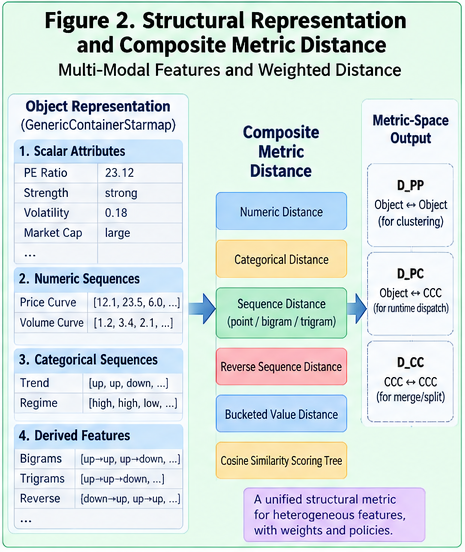

# CSFR-004 — CCC Metric and Runtime Structural Localization

## From Folded Cluster CCCs to Runtime Dispatch and Per-Node Intelligence

**CCC Structural Folding Runtime (CSFR)**
**CSFR-004**

---

## Abstract

CSFR-003 defines how a metric-space sequence cluster can be folded into a **Cluster CCC**:

$$
CCC_C =
[P_0,P_1,\ldots,P_{n-1}],
$$

where each \(P_j\) is a weighted structural possibility set.

The next runtime problem is:

> **How should an incoming object be compared with such a folded structure?**

This paper introduces the **Object-to-CCC Structural Distance**:

$$
D_{PC}(x,CCC),
$$

which compares a concrete object against a policy-compressed structural possibility set.

Unlike object-to-object distance \(D_{PP}\), which compares value to value, \(D_{PC}\) compares:

$$
\text{value}
\leftrightarrow
\text{weighted candidate set}.
$$

For aligned sequence CCCs, a canonical positional distance is:

$$
d_j(x_j,P_j) =
\sum_{v\in P_j}
p_j(v)d(x_j,v),
$$

and the complete sequence distance can be aggregated as:

$$
D_{PC}(x,CCC) =
\frac{
\sum_j w_jd_j(x_j,P_j)
}{
\sum_jw_j
}.
$$

This metric turns a Cluster CCC into an executable runtime interface.

At each node, an incoming object can be compared with child CCCs and routed according to a dispatch policy:

$$
Child(x) =
Policy(
D_{PC}(x,CCC_1),
\ldots,
D_{PC}(x,CCC_k)
).
$$

Repeated dispatch produces **Structural Localization**:

$$
x
\rightarrow
N_0
\rightarrow
N_1
\rightarrow
\cdots
\rightarrow
N_L.
$$

The resulting leaf can then activate specialized **Per-Node Intelligence**.

This paper also introduces ambiguity-aware dispatch, threshold rejection, unknown-pattern handling, confidence margins, Top-N routing, fallback policies, and runtime audit traces.

The central result is:

$$
\boxed{
Folded\ CCC
+
CCC\ Metric =
Runtime\ Structural\ Dispatcher
}
$$

CSFR therefore converts offline structural folding into online runtime localization.

---

# 1. From Folded Structure to Runtime Structure

CSFR-003 produces:

$$
Cluster
\rightarrow
Cluster\ CCC.
$$

But a folded structure is not yet operational until an incoming object can interact with it.

Suppose a node has child CCCs:

$$
CCC_1,
CCC_2,
\ldots,
CCC_k.
$$

An incoming object \(x\) must answer:

> Which child structure is the best match?

This requires:

$$
D_{PC}(x,CCC_i).
$$

The metric is therefore the bridge between:

```text id="c1pq91"
Offline Folding
```

and:

```text id="k2m6ar"
Online Localization
```

---



---

# 2. The Three CSFR Metric Relationships

CSFR distinguishes three metric relationships.

$$
D_{PP}
:
Object
\leftrightarrow
Object
$$

$$
D_{PC}
:
Object
\leftrightarrow
Cluster\ CCC
$$

$$
D_{CC}
:
CCC
\leftrightarrow
CCC
$$

Their primary roles are different.

```text id="f86m0u"
D_PP
→ clustering
→ nearest-pair analysis
→ K discovery

D_PC
→ runtime dispatch
→ localization
→ candidate verification

D_CC
→ CCC organization
→ structural merge/split
→ CCC hierarchy
```

This paper focuses on \(D_{PC}\).

---

# 3. Why D_PC Is Not D_PP

Object-to-object distance compares concrete values.

Example:

```text id="o3r9un"
Target:
UP

Pattern:
DOWN
```

The distance is:

$$
d(UP,DOWN).
$$

But a CCC position may contain:

```text id="v77qux"
UP      0.55
FLAT    0.30
DOWN    0.15
```

Now the comparison is:

$$
UP
\leftrightarrow
\{
UP:0.55,
FLAT:0.30,
DOWN:0.15
\}.
$$

This is not point-to-point comparison.

It is:

$$
\boxed{
Point
\leftrightarrow
Structural\ Possibility\ Set
}
$$

---

# 4. Canonical Positional CCC Distance

Let target sequence be:

$$
T =
[t_0,t_1,\ldots,t_{n-1}]
$$

and Cluster CCC be:

$$
CCC =
[P_0,P_1,\ldots,P_{n-1}].
$$

Each position is:

$$
P_j =
\{
(v_1,p_1),
(v_2,p_2),
\ldots,
(v_q,p_q)
\}.
$$

A canonical positional distance is:

$$
d_j(t_j,P_j) =
\sum_{r=1}^{q}
p_r d(t_j,v_r).
$$

This is a weighted consensus distance.

---

# 5. Intuition of Consensus Distance

Suppose:

```text id="8rkaex"
Target = UP
```

and:

```text id="r20fbc"
CCC Position

UP      0.60
FLAT    0.30
DOWN    0.10
```

Assume:

$$
d(UP,UP)=0,
$$

$$
d(UP,FLAT)=0.5,
$$

$$
d(UP,DOWN)=1.
$$

Then:

$$
d_j =
0.60(0)
+
0.30(0.5)
+
0.10(1)
$$

$$ = 0.25.
$$

The target is close to this structural possibility set, but not perfectly identical.

---

# 6. Why Weighted Consensus Is Useful

The CCC says:

> This position historically contains several meaningful alternatives.

The runtime should respect that information.

A nearest-only rule would compare only to the closest candidate:

$$
\min_v d(t_j,v).
$$

That may be too permissive.

If a target matches a candidate that occurred only 1% of the time, nearest-only distance may still return zero.

Weighted consensus prevents a tiny tail candidate from dominating.

---

# 7. Minimum Distance Variant

A minimum-distance policy may be:

$$
d_j^{min} =
\min_v d(t_j,v).
$$

Advantages:

```text id="6th95i"
very tolerant
good for candidate retrieval
preserves rare alternatives
```

Disadvantages:

```text id="ah2kpt"
can over-credit rare candidates
may reduce discrimination
```

It may be useful in Phase 1 search but not always as the final dispatch metric.

---

# 8. Weighted Mean Variant

The weighted mean is:

$$
d_j^{mean} =
\sum_v p(v)d(t_j,v).
$$

Advantages:

```text id="qtl47u"
uses all retained evidence
reflects candidate support
stable
easy to audit
```

This is a strong default for final metric verification.

---

# 9. Top-M Consensus Variant

Another policy can use only the strongest candidates:

$$
P_j^{(M)} =
TopM(P_j).
$$

Then:

$$
d_j =
\frac{
\sum_{v\in P_j^{(M)}}
p(v)d(t_j,v)
}{
\sum_{v\in P_j^{(M)}}p(v)
}.
$$

This limits long candidate tails.

---

# 10. Trimmed Consensus Distance

A trimmed policy may remove weak or extreme candidate contributions before averaging.

This is useful when:

```text id="n7bqp8"
CCC contains noise
long tails exist
rare historical states should not dominate
```

Thus \(D_{PC}\) itself can be policy-driven.

---

# 11. Confidence-Aware Candidate Weight

A candidate may store both:

```text id="1cydsh"
frequency weight
confidence
```

Then effective weight may be:

$$
w'_v =
p(v)c(v).
$$

Distance becomes:

$$
d_j =
\frac{
\sum_v w'_v d(t_j,v)
}{
\sum_vw'_v
}.
$$

This allows uncertain CCC evidence to contribute less strongly.

---

# 12. Position Weighting

Not all sequence positions have equal runtime importance.

Define:

$$
w_j
$$

for position \(j\).

Then:

$$
D_{PC}(T,CCC) =
\frac{
\sum_j w_j d_j(t_j,P_j)
}{
\sum_jw_j
}.
$$

Example:

```text id="dnt2mk"
context positions    0.5
formation positions  1.0
recent trigger       1.8
```

The structural metric remains explicit.

---

# 13. Dimension Weighting

A structural pattern may contain multiple dimensions:

```text id="8dms3j"
numeric attributes
categorical attributes
numeric sequences
categorical sequences
derived motifs
```

Then:

$$
D_{PC} \
=
\sum_r
w_r
D_r.
$$

For example:

$$
D_{PC} =
0.15D_{numeric}
+
0.10D_{categorical}
+
0.30D_{curve}
+
0.45D_{trajectory}.
$$

---

# 14. Sequence Submetric

A sequence dimension may itself contain:

$$
D_{sequence} =
w_pD_{point}
+
w_bD_{bigram}
+
w_tD_{trigram}
+
w_rD_{reverse}.
$$

This parallels CSFR-002.

The difference is that each channel now compares a target structure with a **folded CCC structure**.

---

# 15. CCC Bigram Representation

A sequence CCC can also derive bigram possibilities.

Suppose:

```text id="r8qs38"
P0 = {UP:0.8, FLAT:0.2}

P1 = {UP:0.6, DOWN:0.4}
```

Possible bigrams include:

```text id="nhre2r"
UP→UP
UP→DOWN
FLAT→UP
FLAT→DOWN
```

A simple estimated weight may be:

$$
p(a\rightarrow b) =
p_0(a)p_1(b)
$$

if independence is assumed.

Better implementations may preserve empirical transition frequencies directly during folding.

---

# 16. Empirical Transition CCC

Instead of reconstructing transition probabilities from position marginals, the fold may preserve:

```text id="52cqjv"
UP→UP      0.47
UP→DOWN    0.31
FLAT→UP    0.14
FLAT→DOWN  0.08
```

This retains more structural information.

Then target bigrams can be compared directly with CCC bigram distributions.

---

# 17. Composite D_PC Tree

A practical CCC distance tree may look like:

```text id="irrm9e"
Object-to-CCC Distance
│
├── Scalar Attributes
│   ├── Numeric-to-CCC
│   └── Category-to-CCC
│
├── Sequence Structure
│   ├── Position Consensus
│   ├── Bigram Distance
│   ├── Trigram Distance
│   └── Reverse Descriptor Distance
│
└── Domain Features
    ├── Regime
    ├── Shape
    └── Structural Motifs
```

The total remains auditable.

---

# 18. Distance vs Similarity

As in CSFR-002, runtime may use either distance or similarity.

Similarity:

$$
Sim_{PC}(x,CCC)
$$

or distance:

$$
D_{PC}(x,CCC).
$$

A normalized conversion may be:

$$
D_{PC} =
1-Sim_{PC}.
$$

Dispatch policy must use one convention consistently.

---

# 19. Node Dispatch

Suppose node \(N\) has child CCCs:

$$
CCC_1,\ldots,CCC_k.
$$

For incoming object \(x\), calculate:

$$
d_i =
D_{PC}(x,CCC_i).
$$

The simplest dispatch is:

$$
Child(x) =
\arg\min_i d_i.
$$

This is Top-1 metric dispatch.

---

# 20. Top-1 Dispatch

Example:

```text id="zxmkxs"
CCC-A   distance = 0.17
CCC-B   distance = 0.41
CCC-C   distance = 0.28
```

Then:

```text id="asw5jk"
dispatch → CCC-A
```

This is simple and efficient.

But it should not be the only available policy.

---

# 21. Why Winner-Take-All Is Not Always Enough

Suppose:

```text id="o297iq"
CCC-A = 0.231
CCC-B = 0.236
CCC-C = 0.710
```

The difference between A and B is tiny.

A hard winner:

```text id="jq5s2q"
A wins
```

hides important ambiguity.

The runtime should be able to recognize:

> The object lies near a structural boundary.

---

# 22. Dispatch Margin

Define best and second-best distances:

$$
d_1
\leq
d_2.
$$

Margin:

$$
M =
d_2-d_1.
$$

Small \(M\) indicates ambiguity.

Large \(M\) indicates a clear winner.

A normalized margin may be:

$$
M_n =
\frac{d_2-d_1}{d_2+\epsilon}.
$$

---

# 23. Margin-Aware Dispatch

Policy example:

```text id="4qr7lm"
if bestDistance > rejectThreshold:
    UNKNOWN

else if margin < ambiguityThreshold:
    TOP_N

else:
    TOP_1
```

This creates more robust localization.

---

# 24. Top-N Dispatch

Instead of one child, retain:

$$
TopN(x) =
\{CCC_{i_1},\ldots,CCC_{i_N}\}.
$$

This is useful for:

```text id="gou7p4"
boundary cases
uncertain objects
two-phase search
beam search
multi-path reasoning
```

Later evidence can resolve the ambiguity.

---

# 25. Beam Localization

A hierarchical runtime can maintain several candidate paths.

```text id="0bnu9m"
Root
├── A 0.22
├── B 0.24
└── C 0.67
```

Keep A and B.

Next level:

```text id="xzw7u2"
A1 0.15
A2 0.38

B1 0.19
B2 0.44
```

The runtime can continue with:

```text id="hak3wx"
A1
B1
```

This is structural beam search.

---

# 26. Threshold Dispatch

A node may define:

$$
\tau_{accept}.
$$

If:

$$
\min_iD_{PC}(x,CCC_i) >
\tau_{accept},
$$

then no child is sufficiently similar.

The runtime may return:

$$
UNKNOWN.
$$

This is essential in open-world systems.

---

# 27. Unknown Is a First-Class Result

A structural runtime should not assume:

> Every future object belongs to an existing historical structure.

Therefore:

$$
UNKNOWN
$$

should be a valid localization state.

This protects against:

```text id="uvqkmx"
new regimes
distribution shift
structural novelty
bad input
insufficient historical coverage
```

---

# 28. Unknown vs Low Confidence

These are different.

## Unknown

No CCC is sufficiently close.

$$
d_1>\tau_{accept}.
$$

## Low Confidence

A CCC is close enough, but several candidates are nearly tied.

$$
d_1\leq\tau_{accept}
$$

and:

$$
M<\tau_{margin}.
$$

This distinction is useful.

---

# 29. Fallback Dispatch

A runtime may support fallback behavior.

Example:

```text id="pivlt0"
UNKNOWN at fine node
        ↓
fallback to parent regime
        ↓
use broader Per-Node Intelligence
```

This prevents complete failure.

---

# 30. Parent-Level Localization

Suppose a fine-grained leaf cannot confidently classify the object.

The parent node may still provide meaningful context.

Thus:

$$
FineLocalization
\rightarrow
Fallback
\rightarrow
CoarserLocalization.
$$

This is preferable to forced false precision.

---

# 31. Runtime Localization Path

Repeated dispatch yields:

$$
x
\rightarrow
N_0
\rightarrow
N_1
\rightarrow
\cdots
\rightarrow
N_L.
$$

The full path is itself meaningful.

Example:

```text id="mygq8v"
Market
↓
High Volatility
↓
Uptrend Formation
↓
Late Breakout
↓
Leaf-037
```

Localization therefore provides both:

```text id="wqk8cx"
leaf identity
```

and:

```text id="5trnuv"
structural path
```

---

# 32. Structural Localization

CSFR defines runtime structural localization as:

> **The process of mapping an incoming object into a folded CCC hierarchy through repeated policy-controlled object-to-CCC comparison.**

Formally:

$$
Localization(x) =
(N_0,N_1,\ldots,N_L).
$$

---

# 33. Localization Before Prediction

The runtime first answers:

> Where does this object structurally belong?

Only then should downstream intelligence answer:

> What should be predicted or done?

Thus:

$$
Object
\rightarrow
Localization
\rightarrow
Local\ Intelligence
\rightarrow
Prediction/Decision.
$$

This differs from:

$$
Object
\rightarrow
Global\ Prediction.
$$

---

# 34. Per-Node Intelligence

Once localized, a node may expose specialized intelligence.

Examples:

```text id="gmm9tf"
local statistics
historical outcomes
specialized predictor
local rules
local policy
local agent
domain heuristics
local uncertainty model
```

Thus:

$$
Node =
CCC
+
Local\ Intelligence.
$$

---

# 35. Localization + Per-Node Intelligence

The architecture becomes:

$$
\boxed{
Structural\ Localization
+
Per\text{-}Node\ Intelligence
}
$$

This allows:

```text id="g0b8r8"
global structure
```

to remain separate from:

```text id="144h86"
local specialization
```

A node can evolve its intelligence without changing the entire hierarchy.

---

# 36. Different Metrics at Different Nodes

Node \(N\) may use metric policy:

$$
D_{PC}^{(N)}.
$$

At a high-level node:

```text id="0zhp8d"
broad regime
volatility
macro structure
```

may dominate.

At a deeper node:

```text id="80n95c"
fine motif
recent transition
local shape
```

may dominate.

Thus localization itself may be hierarchical in metric semantics.

---

# 37. Per-Node Dispatch Policy

Different nodes may also use different dispatch rules.

Example:

```text id="ur4tr2"
Root:
Top-1

Middle Node:
Top-2 if margin < 0.05

Leaf Parent:
strict threshold

Novelty Node:
UNKNOWN allowed
```

This is a natural form of Per-Node Intelligence.

---

# 38. Dispatch Tree vs Classification Tree

A CCC dispatch tree is not necessarily a conventional supervised classification tree.

It may be built from:

```text id="c19h67"
metric clustering
structural merge
CCC hierarchy
runtime policies
```

The leaf meaning may emerge from structural organization rather than predefined class labels.

---

# 39. Localization Confidence

A runtime can define confidence from:

```text id="zfw55y"
best distance
margin
CCC entropy
node depth
candidate count
historical support
```

One simple confidence score is:

$$
Conf =
(1-d_1)
\cdot
g(M)
$$

where \(g\) increases with margin.

More sophisticated confidence models can be attached later.

---

# 40. CCC Entropy and Runtime Confidence

From CSFR-003, position entropy is:

$$
H(P_j) =
-\sum_vp(v)\log p(v).
$$

A CCC with high entropy across many positions may be less discriminative.

Runtime may reduce confidence accordingly.

Thus:

$$
CCC\ Quality
\rightarrow
Dispatch\ Confidence.
$$

---

# 41. Node Support

A CCC may record the number of source samples:

$$
support(CCC).
$$

A node with:

```text id="cj854q"
support = 30,000
```

may be more statistically stable than one with:

```text id="qzbm99"
support = 8
```

Support can influence confidence or fallback policy.

---

# 42. Runtime Audit Trace

Every dispatch should be explainable.

Example:

```text id="735di8"
Node: ROOT

Candidate A
Distance = 0.18
Trend contribution = 0.08
Volume contribution = 0.04
Bigram contribution = 0.03
Trigram contribution = 0.03

Candidate B
Distance = 0.31

Candidate C
Distance = 0.44

Selected: A
Margin: 0.13
Policy: TOP_1
```

This creates a structural audit trail.

---

# 43. Full Localization Trace

Example:

```text id="j2tsqd"
Input Pattern P-2026-0904

ROOT
→ CCC-02
distance 0.19

CCC-02
→ CCC-02-07
distance 0.16

CCC-02-07
→ CCC-02-07-03
distance 0.14

Leaf:
CCC-02-07-03

Confidence:
0.83
```

This is much easier to inspect than a black-box single prediction.

---

# 44. Canonical Java-Like Distance

```java id="q45jdp"
double calcDistance(
        List<String> target,
        SequenceClusterCCC ccc,
        CCCMetricPolicy policy) {

    double weightedDistance = 0.0;
    double totalWeight = 0.0;

    for (PositionCCC positionCCC
            : ccc.getPositions()) {

        int j = positionCCC.getPosition();

        String targetValue =
                target.get(j);

        double localDistance =
                calcConsensusDistance(
                        targetValue,
                        positionCCC.getCandidates(),
                        policy
                );

        double positionWeight =
                positionCCC.getPositionWeight();

        weightedDistance +=
                positionWeight * localDistance;

        totalWeight +=
                positionWeight;
    }

    return weightedDistance / totalWeight;
}
```

---

# 45. Consensus Distance Pseudocode

```java id="6pj97u"
double calcConsensusDistance(
        String targetValue,
        List<ValueWeight> candidates,
        CCCMetricPolicy policy) {

    double weightedDistance = 0.0;
    double totalWeight = 0.0;

    for (ValueWeight candidate : candidates) {

        double d =
                policy.valueDistance(
                        targetValue,
                        candidate.value()
                );

        double w =
                candidate.weight();

        weightedDistance +=
                w * d;

        totalWeight += w;
    }

    return weightedDistance / totalWeight;
}
```

---

# 46. Node Dispatch Pseudocode

```java id="uvwpdz"
DispatchResult dispatch(
        StructuralPattern input,
        RuntimeNode node) {

    List<CandidateScore> scores =
            new ArrayList<>();

    for (RuntimeNode child
            : node.getChildren()) {

        double distance =
                child.getMetric()
                     .calcDistance(
                         input,
                         child.getCCC()
                     );

        scores.add(
                new CandidateScore(
                        child,
                        distance
                )
        );
    }

    scores.sort(
        Comparator.comparingDouble(
            CandidateScore::distance
        )
    );

    return node.getDispatchPolicy()
               .select(scores);
}
```

---

# 47. Localization Loop

```java id="2gvjtm"
RuntimeNode localize(
        StructuralPattern input,
        RuntimeNode root) {

    RuntimeNode current = root;

    while (!current.isLeaf()) {

        DispatchResult result =
                dispatch(input, current);

        if (result.isUnknown()) {
            return current.getFallbackNode();
        }

        current =
                result.getSelectedNode();
    }

    return current;
}
```

A production implementation may support Top-N and beam paths.

---

# 48. Ambiguity-Aware Result

A richer result can be:

```java id="1o3twg"
class DispatchResult {

    DispatchStatus status;

    List<CandidateScore> candidates;

    RuntimeNode selectedNode;

    double bestDistance;

    double margin;

    double confidence;

}
```

Where:

```text id="5xbkye"
DispatchStatus
├── CONFIDENT
├── AMBIGUOUS
├── UNKNOWN
└── FALLBACK
```

---

# 49. Structural Leaf

A leaf should not be treated merely as an ID.

A leaf may contain:

```text id="eqetuj"
Cluster CCC
historical support
local statistics
outcome distribution
local model
policy
audit metadata
version
```

Thus a leaf is a localized structural runtime unit.

---

# 50. Historical Outcome Space

A leaf may store observed downstream outcomes.

Example:

```text id="jxqpxw"
Leaf L37

Historical outcomes:

Strong Positive      0.18
Moderate Positive    0.46
Moderate Negative    0.27
Strong Negative      0.09
```

The runtime does not need to collapse this into one deterministic prediction.

---

# 51. Localization as Query

An incoming object effectively asks:

> Which historical structural regime is most compatible with me?

The runtime answers:

$$
x
\rightarrow
Leaf.
$$

Then the application can query:

```text id="51f0j3"
historical outcomes
local model
risk profile
recommended policy
```

This cleanly separates navigation from application logic.

---

# 52. Structural Boundary Detection

When two child CCCs have similar distance, the object may lie near a structural boundary.

This can be recorded explicitly:

```text id="7biwp0"
BOUNDARY:
CCC-A / CCC-B
```

Boundary cases may deserve special handling.

---

# 53. Boundary Per-Node Intelligence

A boundary case could trigger:

```text id="v2o9hc"
special model
additional features
Two-Phase search
human review
delayed decision
multi-branch analysis
```

Thus ambiguity itself becomes actionable structure.

---

# 54. Unknown-Pattern Node

A runtime may include a dedicated:

```text id="u1gn28"
UNKNOWN / NOVELTY
```

branch.

Objects routed there can be collected for:

```text id="wog7t7"
future clustering
new CCC creation
structural evolution
```

This supports continual growth.

---

# 55. Runtime Feedback to Offline Folding

Localization results can expose:

```text id="mltwy6"
frequent UNKNOWN cases
unstable boundaries
bad CCCs
overloaded leaves
high-entropy nodes
```

These signals can trigger offline maintenance.

Thus:

$$
Runtime
\rightarrow
Structural\ Feedback
\rightarrow
Refolding.
$$

---

# 56. Split Trigger

A node may require splitting if:

```text id="ep90fa"
high internal variance
high CCC entropy
frequent ambiguous dispatch
poor local outcome coherence
```

Then:

$$
Node
\rightarrow
Recluster
\rightarrow
New\ Child\ CCCs.
$$

---

# 57. Merge Trigger

Two nodes may be candidates for merge if:

$$
D_{CC}(CCC_A,CCC_B)
$$

is small and their runtime behavior is similar.

This connects localization back to structural maintenance.

---

# 58. Tree Growth

A structural runtime can evolve:

```text id="j7wldn"
Leaf
↓
collect new variation
↓
detect inconsistency
↓
candidate split
↓
cluster
↓
fold new CCCs
↓
grow child nodes
```

This connects CSFR with continual structural learning.

---

# 59. Offline and Online Consistency

A strong CSFR system should preserve compatible semantics across:

```text id="up46u4"
offline D_PP
offline clustering
offline CCC folding
online D_PC
online dispatch
```

If offline clustering groups objects using one structural language but online dispatch uses an unrelated metric, localization may become unstable.

---

# 60. Shared Metric Primitives

Therefore \(D_{PP}\) and \(D_{PC}\) should often reuse:

```text id="u2ij46"
same feature schema
same buckets
same sequence transforms
same n-gram vocabulary
same position semantics
same normalization
```

while differing in target form.

This creates a common structural language.

---

# 61. Runtime Cost

If a node has \(k\) children and each \(D_{PC}\) evaluation costs \(C_d\), then node dispatch cost is approximately:

$$
O(kC_d).
$$

For a tree of depth \(L\):

$$
O(LkC_d)
$$

under roughly uniform branching.

This can be much cheaper than brute-force comparison against all historical patterns.

---

# 62. Why Hierarchical Localization Matters

Suppose there are:

$$
100,000
$$

leaf CCCs.

Flat comparison requires:

$$
100,000
$$

CCC distance calculations.

A hierarchical dispatcher may reduce search dramatically.

This is one of the runtime benefits of folding plus localization.

---

# 63. But Tree Dispatch Can Misroute

Hierarchical search introduces a risk:

> An early wrong branch may exclude the correct leaf.

Possible mitigations include:

```text id="k29nr4"
Top-N dispatch
beam search
fallback
Two-Way CCC retrieval
Two-Phase search
periodic cross-branch verification
```

These are especially important for difficult boundary cases.

---

# 64. Two-Phase Structural Search Preview

A future runtime can use:

```text id="dkn59s"
Phase 1
CCC DNA / cheap structural retrieval
        ↓
Candidate CCCs

Phase 2
Full D_PC metric verification
        ↓
Final localization
```

This is developed in CSFR-005.

---

# 65. Runtime Policy Is Not One Formula

A mature CSFR runtime may combine:

```text id="7gbp4q"
distance
margin
threshold
support
entropy
confidence
node policy
search budget
```

Dispatch is therefore:

$$
Decision =
Policy(
Distance,
Margin,
Confidence,
Structure
).
$$

This is more general than pure nearest-neighbor routing.

---

# 66. Canonical Dispatch Equation

The simplest canonical form is:

$$
d_i =
D_{PC}(x,CCC_i)
$$

followed by:

$$
Child(x) =
Policy(d_1,\ldots,d_k).
$$

A strict nearest-child policy is:

$$
Child(x) =
\arg\min_i d_i.
$$

A production CSFR system should permit broader policy behavior.

---

# 67. Canonical Localization Equation

Let:

$$
N_{l+1} =
Dispatch(x,N_l).
$$

Then:

$$
Localization(x) =
(N_0,N_1,\ldots,N_L)
$$

until one of the following occurs:

```text id="ykvi2r"
leaf reached
UNKNOWN returned
fallback activated
search budget exhausted
```

---

# 68. Canonical Runtime Pipeline

```text id="pmyixd"
Incoming Object
      │
      ▼
Structural Encoding
      │
      ▼
Current Runtime Node
      │
      ▼
Compare Against Child CCCs
      │
      ▼
D_PC Candidate Scores
      │
      ▼
Dispatch Policy
      │
 ┌────┼───────────┐
 │    │           │
 ▼    ▼           ▼
Top-1 Top-N    UNKNOWN
 │    │           │
 └────┴─────┬─────┘
            ▼
      Next Runtime Node
            │
            ▼
        Repeat
            │
            ▼
     Structural Leaf
            │
            ▼
    Per-Node Intelligence
```

---

# 69. CSFR Runtime Contract

The runtime contract can now be stated explicitly.

Each dispatchable node should provide:

```text id="hmtxpa"
1. Cluster CCC
2. CCC Metric Policy
3. Dispatch Policy
4. Structural Metadata
5. Optional Per-Node Intelligence
```

This is enough to make the node operational.

---

# 70. Core Claims

### Claim 1 — A Cluster CCC becomes operational only when a compatible object-to-CCC metric exists.

$$
CCC + D_{PC}
\rightarrow
Runtime\ Interface.
$$

---

### Claim 2 — \(D_{PC}\) is structurally different from \(D_{PP}\).

It compares concrete values against folded possibility sets.

---

### Claim 3 — Weighted consensus distance is a natural default for possibility-set comparison.

It respects both candidate distance and candidate support.

---

### Claim 4 — Runtime dispatch should be policy-driven rather than hard-coded to winner-take-all.

Top-N, thresholds, ambiguity, fallback, and UNKNOWN are legitimate runtime behaviors.

---

### Claim 5 — UNKNOWN should be a first-class structural result.

Open-world systems should not force every object into an existing historical regime.

---

### Claim 6 — Repeated CCC dispatch produces Structural Localization.

$$
Object
\rightarrow
Structural\ Path
\rightarrow
Leaf.
$$

---

### Claim 7 — Localization should precede downstream prediction or decision when structural context matters.

$$
Localization
+
Per\text{-}Node\ Intelligence
$$

is a reusable architecture.

---

### Claim 8 — Runtime traces can become structural audit artifacts.

Distances, margins, policies, and paths are inspectable.

---

# 71. What This Paper Does Not Fully Define

This paper does not yet fully define:

* CCC DNA construction;
* reverse structural indexing;
* candidate CCC retrieval;
* Two-Way CCC dispatch;
* Two-Phase structural search;
* large-scale reverse-index acceleration.

These are developed in CSFR-005.

---

# 72. Relationship to Previous CSFR Papers

The sequence is now:

```text id="0nqj7g"
CSFR-001
Why Structural Folding Runtime?

        ↓

CSFR-002
How are objects represented and compared?

        ↓

CSFR-003
How are clusters folded into CCCs?

        ↓

CSFR-004
How do CCCs perform runtime localization?

        ↓

CSFR-005
How can CCC DNA enable reverse and accelerated search?
```

CSFR-004 is the transition from folding to execution.

---

# 73. Closing Perspective

A cluster becomes useful for runtime intelligence only when a new object can meaningfully interact with its folded representation.

That interaction is provided by:

$$
\boxed{
D_{PC}
:
Object
\leftrightarrow
Cluster\ CCC
}
$$

Once \(D_{PC}\) exists, the Cluster CCC stops being merely a compact historical summary.

It becomes a dispatch handle.

A set of child CCCs becomes a structural decision surface.

A hierarchy of CCCs becomes a navigable runtime.

Repeated navigation becomes localization.

And localization creates a stable place for specialized intelligence to operate.

Thus the runtime chain becomes:

$$
\boxed{
Cluster
\rightarrow
CCC
\rightarrow
CCC\ Metric
\rightarrow
Dispatch
\rightarrow
Localization
\rightarrow
Per\text{-}Node\ Intelligence
}
$$

This is the operational heart of CCC Structural Folding Runtime.

The next step is to make this runtime scalable and bidirectional.

That requires extracting reusable structural signatures from CCCs and using them as reverse-search handles.

---

## Next

**CSFR-005 — CCC DNA, Two-Way Dispatch, and Two-Phase Structural Search**

The next paper develops CCC DNA, reverse structural indexing, bigram/trigram signatures, bucketed-value signatures, candidate retrieval, Two-Way CCC dispatch, and Two-Phase search in which cheap structural retrieval precedes full \(D_{PC}\) metric verification.

---

**CCC Structural Folding Runtime (CSFR)**
*From Metric-Space Objects to Runtime Localization*
