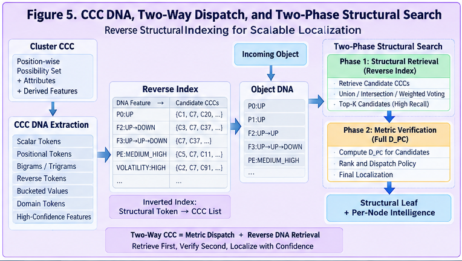

# CSFR-005 — CCC DNA, Two-Way Dispatch, and Two-Phase Structural Search

## Reverse Structural Indexing for Scalable CCC Runtime Localization

**CCC Structural Folding Runtime (CSFR)**
**CSFR-005**

---

## Abstract

CSFR-004 establishes a forward runtime path:

$$
Object
\rightarrow
D_{PC}
\rightarrow
CCC\ Dispatch
\rightarrow
Structural\ Localization.
$$

This path is operational, but large-scale systems may contain thousands or millions of CCCs. Directly evaluating a full object-to-CCC metric against every candidate can become expensive.

This paper introduces **CCC DNA** as a compact structural signature extracted from a Cluster CCC.

CCC DNA may include:

* bucketed numeric values;
* categorical states;
* dominant positional values;
* forward bigrams;
* reverse bigrams;
* forward trigrams;
* reverse trigrams;
* transition motifs;
* structural ranges;
* high-confidence features;
* domain-specific structural tokens.

These elements can be indexed in reverse:

$$
DNA\ Feature
\rightarrow
Candidate\ CCCs.
$$

This enables a complementary runtime direction:

$$
Observed\ Structural\ Evidence
\rightarrow
Candidate\ CCCs
\rightarrow
Full\ Metric\ Verification.
$$

Together with conventional metric dispatch, this forms a **Two-Way CCC Dispatcher**.

The canonical scalable runtime becomes:

$$
\boxed{
Phase\ 1:
Structural\ Retrieval
}
$$

followed by:

$$
\boxed{
Phase\ 2:
Full\ CCC\ Metric\ Verification
}
$$

or:

$$
Object
\rightarrow
DNA
\rightarrow
Candidate\ CCCs
\rightarrow
D_{PC}
\rightarrow
Localization.
$$

This architecture reduces brute-force search while preserving metric rigor in the final decision.

CCC DNA therefore acts as a structural search handle, reverse index key, runtime acceleration layer, and bridge between folded structural representation and scalable localization.

---

# 1. The Scaling Problem

Suppose a runtime contains:

$$
N
$$

Cluster CCCs.

A direct flat search evaluates:

$$
D_{PC}(x,CCC_i)
$$

for every:

$$
i=1,\ldots,N.
$$

The cost is approximately:

$$
O(NC_d),
$$

where \(C_d\) is the cost of one full CCC metric evaluation.

For small \(N\), this may be acceptable.

For large \(N\), it becomes inefficient.

The runtime therefore needs a cheaper mechanism to answer:

> Which CCCs are worth evaluating in full?

---

# 2. Forward Metric Dispatch

The canonical forward direction from CSFR-004 is:

```text id="s5hn4z"
Incoming Object
       ↓
Full Structural Encoding
       ↓
D_PC Against Candidate CCCs
       ↓
Dispatch Policy
       ↓
Localized Node
```

This direction is precise.

But it assumes the candidate set is already manageable.

The scaling problem appears when:

```text id="8qolwb"
Candidate CCCs ≈ all CCCs
```

---

# 3. Reverse Structural Access

CSFR introduces a second direction.

Instead of asking:

> Which CCC is metrically closest?

we first ask:

> Which CCCs contain structural features similar to the incoming object?

This gives:

$$
Structural\ Evidence
\rightarrow
Candidate\ CCCs.
$$

The candidate set can then be verified using the full metric.

This is reverse structural access.

---

# 4. CCC DNA

A Cluster CCC contains many reusable structural elements.

For example:

```text id="963ms1"
CCC-037

Position 0
UP      0.82

Position 1
UP      0.61
FLAT    0.32

Position 2
DOWN    0.74

PE_BUCKET = MEDIUM_HIGH

VOLATILITY = HIGH
```

Derived signatures might include:

```text id="r8mx5j"
P0:UP
P1:UP
P1:FLAT
P2:DOWN
PE:MEDIUM_HIGH
VOLATILITY:HIGH
BIGRAM:UP→UP
BIGRAM:UP→DOWN
TRIGRAM:UP→UP→DOWN
```

These signatures form the **CCC DNA**.

---

# 5. Definition of CCC DNA

Let:

$$
CCC
$$

be a folded structural representation.

Define:

$$
DNA(CCC)
=
\{
f_1,f_2,\ldots,f_m
\},
$$

where each \(f_i\) is a structurally meaningful feature extracted from the CCC.

The extraction is policy-driven:

$$
DNA_\pi(CCC).
$$

Thus CCC DNA is not necessarily the complete CCC.

It is a selected structural signature optimized for retrieval.

---

# 6. Why the Term DNA Is Useful

The analogy is structural rather than biological.

CCC DNA refers to a compact set of features that can identify or retrieve related folded structures.

Its purpose is:

```text id="7yq6ax"
compactness
discrimination
indexability
retrievability
structural reuse
```

The full CCC remains the authoritative runtime representation.

DNA is the search handle.

---

# 7. DNA Is Not the CCC

This distinction is critical.

$$
DNA(CCC)
\neq
CCC.
$$

The CCC may contain:

```text id="qk1ws3"
full positional distributions
weights
entropy
ranges
support
policy metadata
```

DNA may contain only:

```text id="6tu82o"
dominant values
selected alternatives
bigrams
trigrams
bucket states
high-confidence motifs
```

Thus:

$$
CCC
\rightarrow
DNA
$$

is another policy-controlled compression.

---

# 8. Canonical CCC DNA Categories

A practical DNA schema may include:

```text id="xalr22"
1. Scalar DNA
2. Positional DNA
3. Sequence DNA
4. Transition DNA
5. Range DNA
6. Confidence DNA
7. Domain DNA
```

Each category serves a different retrieval role.

---

# 9. Scalar DNA

Scalar DNA may include:

```text id="6zidti"
PE:MEDIUM
STRENGTH:STRONG
VOLATILITY:HIGH
REGIME:RISK_ON
```

These are easy to index.

They are useful for coarse structural filtering.

---

# 10. Positional DNA

Positional DNA preserves sequence location.

Example:

```text id="tguj2l"
P0:UP
P1:UP
P2:DOWN
```

This differs from:

```text id="eywh6b"
UP
UP
DOWN
```

because position remains part of the key.

Thus:

$$
Position
+
Value
\rightarrow
DNA\ Token.
$$

---

# 11. Weighted Positional DNA

The runtime may retain only candidates above a threshold.

Example CCC position:

```text id="4f043m"
UP      0.72
FLAT    0.21
DOWN    0.07
```

With threshold:

$$
\tau=0.20,
$$

DNA contains:

```text id="na21vu"
P3:UP
P3:FLAT
```

but not:

```text id="fmho54"
P3:DOWN
```

This reduces index noise.

---

# 12. Sequence DNA

Sequence DNA can include local motifs.

Example:

```text id="pqma0g"
UP→UP
UP→DOWN
DOWN→FLAT
```

These capture local trajectory structure.

They are often more discriminative than isolated values.

---

# 13. Trigram DNA

Trigrams preserve more context.

Example:

```text id="jsgk63"
UP→UP→DOWN
UP→DOWN→FLAT
```

Trigram DNA can sharply narrow candidate sets.

But it may also become sparse.

Therefore n-gram length is a retrieval-resolution parameter.

---

# 14. Forward DNA

Forward DNA preserves the natural sequence direction:

$$
x_j
\rightarrow
x_{j+1}.
$$

Example:

```text id="0ijm7m"
UP→UP
UP→DOWN
```

This is the primary trajectory channel.

---

# 15. Reverse DNA

Reverse DNA may also be indexed:

```text id="w8b7d1"
DOWN←UP
UP←UP
```

or represented explicitly as reverse transitions.

The purpose is not to erase temporal direction.

It is to provide a second retrieval perspective.

---

# 16. Keep Forward and Reverse Separate

Forward and reverse DNA should normally use separate namespaces.

For example:

```text id="6d9pxk"
F2:UP→DOWN
R2:DOWN→UP
```

This prevents directional information from being lost.

A runtime may weight them differently.

---

# 17. Numeric Range DNA

For numeric CCC candidates, DNA may encode ranges.

Example:

```text id="9t7pfj"
PE:[20,25]
RSI:[55,65]
VOLATILITY:[0.18,0.24]
```

An incoming numeric value can retrieve all CCCs whose ranges overlap.

This creates a structural interval index.

---

# 18. Bucket DNA

Buckets often make better reverse keys than raw values.

Example:

```text id="yp4fl3"
PE:MEDIUM_HIGH
RSI:HIGH
VOLUME:STRONG
```

These keys are stable and easy to hash.

This is one reason bucketing is useful beyond similarity scoring.

---

# 19. Confidence DNA

A runtime may extract only high-confidence CCC features.

For candidate \(v\):

$$
p(v)\geq\tau_{DNA}.
$$

Example:

```text id="l4slxk"
UP 0.91
```

becomes DNA.

But:

```text id="9f8xql"
FLAT 0.09
```

does not.

This creates a more discriminative index.

---

# 20. Entropy-Aware DNA

High-entropy positions may be poor retrieval keys.

Suppose:

```text id="hu8tkj"
UP      0.34
DOWN    0.33
FLAT    0.33
```

This position has little discriminative value.

A DNA policy may exclude it.

Thus:

$$
High\ Entropy
\rightarrow
Low\ DNA\ Priority.
$$

---

# 21. Core DNA vs Delta DNA

From the Core-plus-Delta interpretation:

$$
CCC
=
Core
+
\Delta.
$$

DNA may also be separated:

```text id="v84b36"
Core DNA
Delta DNA
```

Core DNA contains stable dominant structure.

Delta DNA contains meaningful alternatives.

This enables different retrieval strategies.

---

# 22. Core-First Retrieval

A fast Phase 1 search may use only Core DNA.

```text id="suxwdc"
Incoming Pattern
      ↓
Core DNA
      ↓
Strong Candidate CCCs
```

This is highly efficient.

---

# 23. Delta-Assisted Retrieval

If Core DNA produces too few candidates, the runtime may add Delta DNA:

```text id="6chx2k"
Core Retrieval
      ↓
insufficient candidates
      ↓
Delta Expansion
      ↓
larger candidate set
```

This creates adaptive retrieval depth.

---

# 24. Reverse Index

For every DNA feature \(f\), maintain:

$$
Index(f)
=
\{CCC_i\}.
$$

Example:

```text id="25ubwn"
P0:UP
→ CCC-003
→ CCC-017
→ CCC-037
→ CCC-102
```

Another:

```text id="kf9c8e"
TRIGRAM:UP→UP→DOWN
→ CCC-017
→ CCC-037
```

The reverse index maps structural evidence to folded structures.

---

# 25. Inverted-Index Interpretation

CCC DNA indexing resembles a classical inverted index.

Instead of:

```text id="1uh75g"
word → documents
```

we have:

```text id="30wxpq"
structural token → CCCs
```

This is a powerful engineering simplification.

Large-scale structural retrieval can therefore reuse mature indexing ideas.

---

# 26. Incoming Object DNA

The incoming object can generate its own retrieval signature:

$$
DNA(x).
$$

Example:

```text id="u71r1b"
P0:UP
P1:UP
P2:DOWN
PE:MEDIUM_HIGH
BIGRAM:UP→UP
BIGRAM:UP→DOWN
TRIGRAM:UP→UP→DOWN
```

Then candidate CCCs are retrieved from the reverse index.

---

# 27. Candidate Union

A simple retrieval policy uses union:

$$
Candidates(x)
=
\bigcup_{f\in DNA(x)}
Index(f).
$$

This maximizes recall.

But candidate sets may become large.

---

# 28. Candidate Intersection

A stricter policy uses intersection:

$$
Candidates(x)
=
\bigcap_{f\in F}
Index(f).
$$

This sharply reduces candidate count.

But it may reduce recall.

---

# 29. Weighted Candidate Voting

A better general policy is weighted voting.

For candidate CCC \(c\):

$$
Score_{DNA}(c)
=
\sum_{f\in DNA(x)}
w_f
I[c\in Index(f)].
$$

Then select Top-\(K\) candidate CCCs.

This balances recall and precision.

---

# 30. IDF-Like Structural Weighting

Common DNA features are less discriminative.

Suppose:

```text id="q6x2ct"
P0:UP
```

appears in 80% of CCCs.

It carries little retrieval information.

But:

```text id="4plxj3"
TRIGRAM:UP→FLAT→CRASH
```

may appear in only 1%.

It is highly discriminative.

A structural inverse-frequency weight can be defined:

$$
IDF(f)
=
\log
\frac{N}{1+df(f)},
$$

where:

$$
df(f)
$$

is the number of CCCs containing feature \(f\).

Then:

$$
Score_{DNA}(c)
=
\sum_f
TF_x(f)\cdot IDF(f)\cdot I[c\in Index(f)].
$$

This creates a TF-IDF-like structural retrieval layer.

---

# 31. Weighted Structural Retrieval

More generally:

$$
Score_{DNA}(c)
=
\sum_f
w_f
match(f,c).
$$

Weights may reflect:

```text id="esye5u"
rarity
CCC candidate confidence
position importance
n-gram length
domain importance
temporal direction
entropy
```

This creates a configurable reverse dispatcher.

---

# 32. Two-Way CCC

The runtime now has two complementary directions.

## Forward Direction

$$
Object
\rightarrow
D_{PC}
\rightarrow
CCC.
$$

## Reverse Direction

$$
Object\ DNA
\rightarrow
Reverse\ Index
\rightarrow
Candidate\ CCCs.
$$

Together:

$$
\boxed{
Two\text{-}Way\ CCC
}
$$

---

# 33. Why Two-Way Matters

Forward metric dispatch is precise but potentially expensive.

Reverse DNA retrieval is fast but approximate.

Their strengths complement each other.

```text id="a771cc"
DNA Retrieval
→ high speed
→ broad candidate generation

Full D_PC
→ high precision
→ final verification
```

This naturally produces a Two-Phase architecture.

---

# 34. Two-Phase Structural Search

The canonical design is:

```text id="y6jkb8"
Phase 1 — Structural Retrieval
Incoming Object
      ↓
Object DNA
      ↓
Reverse Index
      ↓
Candidate CCCs

Phase 2 — Metric Verification
Candidate CCCs
      ↓
Full D_PC
      ↓
Rank / Dispatch Policy
      ↓
Final Structural Localization
```

This is the core scalable CSFR search path.

---

# 35. Canonical Equation

Let:

$$
R(x)
$$

be the candidate-retrieval function.

Then:

$$
C_x
=
R(DNA(x)).
$$

Final localization becomes:

$$
CCC^*
=
\arg\min_{c\in C_x}
D_{PC}(x,c).
$$

Thus:

$$
\boxed{
Retrieve\ First,
Verify\ Second
}
$$

---

# 36. Why Retrieval Must Not Replace Verification

DNA is compressed.

Two CCCs may share many DNA features while differing in important weighted details.

Therefore:

$$
DNA\ Match
\neq
Final\ Structural\ Equivalence.
$$

The full CCC metric remains authoritative.

This preserves runtime rigor.

---

# 37. Candidate Recall

Phase 1 must retrieve the true best CCC with high probability.

Let:

$$
CCC^*
$$

be the true best candidate under full \(D_{PC}\).

Candidate recall is:

$$
Recall_K
=
P(CCC^*\in TopK_{DNA}).
$$

This is one of the most important retrieval-quality metrics.

---

# 38. Candidate Reduction Ratio

If total CCC count is \(N\) and Phase 1 returns \(K\):

$$
ReductionRatio
=
1-\frac{K}{N}.
$$

Example:

$$
N=100,000,
\quad
K=100
$$

gives:

$$
99.9\%
$$

candidate reduction.

If recall remains high, this is a major runtime gain.

---

# 39. Phase-1 Precision Is Secondary

Phase 1 does not need perfect precision.

Its primary job is:

> do not miss the right candidates.

Therefore:

$$
Recall
>
Precision
$$

may be the preferred retrieval policy.

Phase 2 provides precision.

---

# 40. Broad-Then-Narrow Search

This creates a general structural principle:

$$
Broad\ Structural\ Match
\rightarrow
Narrow\ Metric\ Verification.
$$

This is often more robust than one expensive global metric pass.

---

# 41. DNA Retrieval as Localization Hint

Phase 1 can also produce hints about where to enter the dispatch tree.

Example:

```text id="qf72ye"
DNA candidates cluster heavily under branch B7
```

Then instead of starting from root:

```text id="pg6d2y"
Root
→ ...
```

the runtime may jump directly toward:

```text id="sa8f5j"
B7
```

This can create **direct structural jumping**.

---

# 42. Direct-Leaf Jumping

If DNA strongly identifies one leaf or a small leaf set, the runtime may perform:

```text id="brn09h"
Object DNA
      ↓
Candidate Leaf IDs
      ↓
Full D_PC Verification
      ↓
Direct Leaf
```

This bypasses much of the hierarchy.

---

# 43. Hierarchical Plus Reverse Search

The runtime does not need to choose only one strategy.

It may combine:

```text id="pl8432"
tree dispatch
+
reverse DNA retrieval
```

For example:

1. tree dispatch gives structural region;
2. DNA retrieval gives cross-branch candidates;
3. full metric compares both.

This reduces early-branch error.

---

# 44. Cross-Branch Recovery

Hierarchical dispatch may misroute at an early node.

DNA retrieval can recover candidates outside the selected branch.

Thus:

$$
Tree\ Search
+
DNA\ Search
\rightarrow
Cross\text{-}Branch\ Robustness.
$$

This is an important benefit.

---



---

# 45. DNA as Secondary Navigation Plane

A useful architecture is:

```text id="ceqjwk"
Primary Plane:
CCC Metric Tree

Secondary Plane:
CCC DNA Reverse Index
```

The tree provides organized hierarchical navigation.

The DNA index provides associative structural navigation.

The two planes complement each other.

---

# 46. Structural Search Plane

CSFR can therefore be viewed as containing two search planes:

$$
\boxed{
Metric\ Navigation\ Plane
}
$$

and:

$$
\boxed{
Structural\ Retrieval\ Plane
}
$$

Their intersection produces final localization.

---

# 47. DNA Namespace Design

DNA tokens should be namespaced.

Example:

```text id="fqjc4k"
ATTR:PE:MEDIUM_HIGH
ATTR:VOL:HIGH
POS:0:UP
POS:1:FLAT
F2:UP→DOWN
R2:DOWN→UP
F3:UP→UP→DOWN
```

This prevents collisions between structurally different feature types.

---

# 48. Position-Aware N-Grams

N-grams may optionally include starting position.

Example:

```text id="za4xe8"
F2@3:UP→DOWN
```

This is more discriminative than:

```text id="s3pwic"
F2:UP→DOWN
```

But also more specific.

The runtime can index both.

---

# 49. Multi-Resolution DNA

A CCC may expose DNA at several levels.

```text id="7i9z2v"
Level 1:
broad scalar buckets

Level 2:
positional states

Level 3:
bigrams

Level 4:
trigrams

Level 5:
rare structural motifs
```

Retrieval can escalate through these levels.

---

# 50. Progressive Retrieval

A progressive policy may be:

```text id="aa7o4g"
coarse DNA
↓
too many candidates?
↓
add positional DNA
↓
still too many?
↓
add bigrams
↓
still too many?
↓
add trigrams
```

This avoids unnecessary fine-grained work.

---

# 51. Adaptive Search Budget

Let:

$$
B
$$

be the search budget.

A node may choose how many DNA channels to use based on:

```text id="ag6vjm"
candidate count
latency target
confidence
system load
application criticality
```

Thus search becomes policy-controlled.

---

# 52. Query-Specific DNA

The incoming object need not expose every possible DNA feature.

A query policy may select:

```text id="bz6cob"
highest-confidence features
rarest features
most recent sequence motifs
most important dimensions
```

This can improve retrieval efficiency.

---

# 53. Rare-First Retrieval

A useful strategy is:

```text id="gprn4m"
sort query DNA by rarity
```

Then start with the rarest tokens.

Example:

```text id="uzwnfh"
common:
P0:UP

rare:
F3:UP→FLAT→DOWN
```

The rare trigram may reduce candidates much faster.

---

# 54. Confidence-First Retrieval

Another strategy begins with the strongest evidence.

For each query feature:

$$
score(f)
=
confidence(f)
\times
discrimination(f).
$$

Then retrieve using highest-scoring features first.

---

# 55. Candidate Accumulation

Candidate score can be accumulated incrementally:

$$
Score_t(c)
=
Score_{t-1}(c)
+
w_fmatch(f,c).
$$

Once enough evidence accumulates, low-scoring CCCs may be pruned.

This supports streaming retrieval.

---

# 56. Early Candidate Pruning

If candidate \(c\) cannot mathematically catch up to the current Top-K score, it may be removed early.

This is a standard search optimization that can also be applied to structural retrieval.

---

# 57. CCC DNA Construction Pipeline

```text id="50kztr"
Cluster CCC
    │
    ▼
Inspect Candidate Values
    │
    ▼
Apply DNA Thresholds
    │
    ▼
Extract Scalar Tokens
    │
    ▼
Extract Positional Tokens
    │
    ▼
Extract Bigrams / Trigrams
    │
    ▼
Extract Structural Motifs
    │
    ▼
Weight / Rank DNA Features
    │
    ▼
Register in Reverse Index
```

---

# 58. Object DNA Construction Pipeline

```text id="2j4cex"
Incoming Object
    │
    ▼
Structural Encoding
    │
    ▼
Bucketing
    │
    ▼
Position Tokens
    │
    ▼
Forward N-Grams
    │
    ▼
Reverse N-Grams
    │
    ▼
Domain Motifs
    │
    ▼
Query DNA
```

---

# 59. Reverse Index Data Structure

A simple implementation:

```java id="jzns1u"
Map<String, Set<String>> dnaToCCCIds;
```

Example:

```java id="c7lf07"
"POS:0:UP"
    → {CCC-1, CCC-7, CCC-20}

"F3:UP>UP>DOWN"
    → {CCC-7, CCC-20}
```

For weighted indexes:

```java id="jvlz4p"
Map<String, Map<String, Double>> dnaToCCCWeights;
```

---

# 60. CCC DNA Object

A practical model:

```java id="3b197q"
class CCCDNA {

    String cccId;

    List<DNAFeature> features;

}
```

with:

```java id="frkzpv"
class DNAFeature {

    String namespace;

    String value;

    double weight;

    double confidence;

}
```

---

# 61. Query DNA

```java id="8ruo6l"
class QueryDNA {

    List<DNAFeature> features;

}
```

The same token model can be reused for CCC and query structures.

---

# 62. Candidate Retrieval Pseudocode

```java id="d88qlg"
Map<String, Double> retrieveCandidates(
        QueryDNA query,
        ReverseIndex index) {

    Map<String, Double> scores =
            new HashMap<>();

    for (DNAFeature feature
            : query.getFeatures()) {

        for (IndexedCCC candidate
                : index.lookup(feature.key())) {

            double contribution =
                    feature.weight()
                  * candidate.indexWeight();

            scores.merge(
                    candidate.cccId(),
                    contribution,
                    Double::sum
            );
        }
    }

    return scores;
}
```

---

# 63. Top-K Retrieval

```java id="07vs3a"
List<String> topK(
        Map<String, Double> scores,
        int k) {

    return scores.entrySet()
            .stream()
            .sorted(
                Map.Entry
                    .<String, Double>
                    comparingByValue()
                    .reversed()
            )
            .limit(k)
            .map(Map.Entry::getKey)
            .toList();
}
```

For Java 8 implementations, collection code can be adapted accordingly.

---

# 64. Two-Phase Verification Pseudocode

```java id="y6ej1f"
LocalizationResult localize(
        StructuralPattern input,
        int candidateLimit) {

    QueryDNA queryDNA =
            dnaEncoder.encode(input);

    List<String> candidateIds =
            reverseIndex.retrieveTopK(
                    queryDNA,
                    candidateLimit
            );

    List<CandidateScore> scores =
            new ArrayList<>();

    for (String cccId : candidateIds) {

        ClusterCCC ccc =
                repository.getCCC(cccId);

        double distance =
                cccMetric.calcDistance(
                        input,
                        ccc
                );

        scores.add(
                new CandidateScore(
                        cccId,
                        distance
                )
        );
    }

    return dispatchPolicy.select(scores);
}
```

---

# 65. Candidate Limit

The candidate count \(K\) is a runtime policy parameter.

Small \(K\):

```text id="in6nep"
fast
risk of missing good candidate
```

Large \(K\):

```text id="jhd0ew"
slower
higher recall
```

Thus:

$$
K
$$

is part of the speed-accuracy tradeoff.

---

# 66. Dynamic Candidate K

Instead of fixed \(K\), use score threshold:

$$
Score_{DNA}(c)\geq\tau.
$$

Or use score gap:

```text id="ku4y90"
retain candidates until score drops sharply
```

This adapts candidate size to query difficulty.

---

# 67. DNA Retrieval Confidence

Let:

$$
s_1\geq s_2\geq\cdots.
$$

A large retrieval gap:

$$
s_1-s_2
$$

may indicate strong structural evidence.

A flat score distribution may indicate ambiguity.

This can influence Phase 2 budget.

---

# 68. Phase-2 Metric Budget

If DNA retrieval is highly confident:

```text id="1jq908"
verify Top-5
```

If ambiguous:

```text id="r1x8mc"
verify Top-100
```

Thus Two-Phase search can allocate computation adaptively.

---

# 69. Unknown Detection in Two-Phase Search

Even if DNA retrieves candidates, Phase 2 may reject all of them.

If:

$$
\min_c D_{PC}(x,c)
>
\tau_{accept},
$$

then return:

$$
UNKNOWN.
$$

DNA match alone must not force acceptance.

---

# 70. DNA Miss

Another failure mode is:

```text id="c1e5ik"
no useful DNA candidates
```

Possible responses:

```text id="dc826d"
fallback to tree search
broaden DNA query
reduce token thresholds
use coarse DNA
run global approximate search
return UNKNOWN
```

Two-Way CCC therefore requires fallback policy.

---

# 71. Search Escalation Ladder

A robust runtime may use:

```text id="jqarug"
Level 1
Rare Core DNA

Level 2
Core + Delta DNA

Level 3
Coarse Tree Search

Level 4
Expanded D_PC Candidate Search

Level 5
UNKNOWN / Novelty
```

This provides graceful degradation.

---

# 72. DNA Index Maintenance

When CCC changes, its DNA may also change.

Therefore updates require:

```text id="4x6cq6"
remove old DNA entries
generate new DNA
register new entries
version index
```

The index must remain consistent with CCC versions.

---

# 73. Versioned DNA

Each DNA artifact should record:

```text id="m9xcn7"
CCC ID
CCC version
DNA policy version
metric version
feature schema version
```

This protects against incompatible retrieval.

---

# 74. Structural Provenance

A candidate retrieval trace may include:

```text id="w68tmm"
Query DNA:
F3:UP→UP→DOWN

Matched:
CCC-037

Reason:
CCC-037 DNA contains same trigram

DNA Policy:
CSFR-DNA-v1.2
```

This makes reverse search auditable.

---

# 75. Full Two-Phase Audit Trace

Example:

```text id="jx8dwp"
PHASE 1 — DNA RETRIEVAL

Query features:
POS:0:UP
POS:1:UP
F2:UP→UP
F3:UP→UP→DOWN

Retrieved:
CCC-037 score 8.4
CCC-102 score 6.1
CCC-011 score 4.9

PHASE 2 — FULL D_PC

CCC-037 distance 0.14
CCC-102 distance 0.26
CCC-011 distance 0.33

Selected:
CCC-037

Status:
CONFIDENT
```

This is structurally interpretable end to end.

---

# 76. Two-Way CCC and Hierarchical Dispatch

A mature CSFR runtime can support three search modes:

```text id="xjtxhy"
Mode A
Hierarchical metric dispatch

Mode B
DNA reverse retrieval + D_PC

Mode C
Hybrid tree + DNA
```

Different workloads may use different modes.

---

# 77. Mode A — Tree-First

```text id="1ax9hz"
Root
↓
metric dispatch
↓
candidate branch
↓
leaf
```

Best when the tree is reliable and shallow.

---

# 78. Mode B — DNA-First

```text id="fhbxl8"
Object
↓
DNA
↓
Top-K CCCs
↓
D_PC
↓
leaf
```

Best when direct reverse lookup is highly discriminative.

---

# 79. Mode C — Hybrid

```text id="pg4gmi"
DNA coarse localization
        +
Tree path candidates
        ↓
combined candidate set
        ↓
D_PC verification
```

This may provide the strongest robustness.

---

# 80. Structural Candidate Fusion

Suppose:

$$
C_{tree}
$$

comes from hierarchical search and:

$$
C_{dna}
$$

from reverse retrieval.

Then:

$$
C_{final}
=
C_{tree}
\cup
C_{dna}.
$$

Or scores may be combined:

$$
Score(c)
=
\lambda Score_{tree}(c)
+
(1-\lambda)Score_{DNA}(c).
$$

Final \(D_{PC}\) still verifies candidates.

---

# 81. DNA as a Shortcut, Not a Truth Source

This principle should remain explicit:

> **CCC DNA accelerates navigation; the full CCC remains the structural truth source.**

Therefore:

$$
DNA
\rightarrow
Candidate
$$

not:

$$
DNA
\rightarrow
Final\ Decision.
$$

---

# 82. Structural Retrieval vs Semantic Embedding Retrieval

CCC DNA retrieval differs from generic embedding nearest-neighbor search.

Embedding retrieval asks:

> Which vectors are close?

CCC DNA retrieval asks:

> Which folded structures expose matching named structural evidence?

The latter is:

```text id="5iq0zz"
explicit
auditable
policy-driven
structurally typed
```

The two methods can coexist.

---

# 83. Hybrid with Vector Indexes

A future implementation may combine:

```text id="43x23u"
CCC DNA inverted index
+
CCC embedding ANN index
+
full D_PC verification
```

This produces:

$$
Symbolic\ Structural\ Retrieval
+
Approximate\ Metric\ Retrieval
+
Exact\ Structural\ Verification.
$$

CSFR does not require this, but the architecture permits it.

---

# 84. DNA Density

A CCC with too many DNA tokens creates index noise.

Define:

$$
Density(CCC)
=
|DNA(CCC)|.
$$

A DNA policy should balance:

$$
Coverage
\leftrightarrow
Discrimination.
$$

---

# 85. Too-Sparse DNA

If DNA contains too few features:

```text id="i0nnsj"
poor recall
weak candidate retrieval
frequent fallback
```

The policy may need to preserve more Delta features.

---

# 86. Too-Dense DNA

If DNA contains too many features:

```text id="nn8dd6"
large posting lists
weak discrimination
high memory usage
noisy candidate scores
```

The policy may need stronger filtering.

---

# 87. DNA Quality Metrics

Useful metrics include:

```text id="bhq0kj"
candidate recall
candidate precision
candidate reduction ratio
mean posting-list length
DNA token count
query latency
Phase-2 candidate count
final localization agreement
```

These allow DNA design to be benchmarked.

---

# 88. Runtime Search Quality

The complete Two-Phase system should be evaluated by:

$$
FinalLocalizationAccuracy
$$

and:

$$
RuntimeCost.
$$

A fast retrieval stage that frequently drops the correct CCC is not acceptable.

A perfect retrieval stage that returns every CCC offers no value.

---

# 89. Retrieval-Latency Frontier

CSFR therefore exposes a frontier:

$$
Recall
\leftrightarrow
Candidate\ Count
\leftrightarrow
Latency.
$$

The optimal operating point depends on application policy.

---

# 90. Offline DNA Construction

The offline pipeline becomes:

```text id="3nm99p"
Historical Objects
      ↓
D_PP
      ↓
Clustering
      ↓
CCC Folding
      ↓
CCC DNA Extraction
      ↓
Reverse Index Construction
      ↓
Runtime Deployment
```

This extends the CSFR folding pipeline.

---

# 91. Online Two-Phase Runtime

The online pipeline becomes:

```text id="h7jsm6"
Incoming Object
      ↓
Structural Encoding
      ↓
Query DNA
      ↓
Reverse Retrieval
      ↓
Candidate CCCs
      ↓
Full D_PC
      ↓
Dispatch Policy
      ↓
Structural Localization
      ↓
Per-Node Intelligence
```

---

# 92. Complete CSFR Architecture

The full five-paper CSFR architecture is now:

```text id="zfizwl"
Objects
   ↓
Structural Representation
   ↓
D_PP
   ↓
Metric-Space Clustering
   ↓
Claw-Dragon Structural Merge
   ↓
Cluster CCC
   ↓
CCC DNA
   ↓
Reverse Candidate Retrieval
   ↓
D_PC Verification
   ↓
Runtime Dispatch
   ↓
Structural Localization
   ↓
Per-Node Intelligence
```

This is the complete runtime chain.

---

# 93. Two-Way Structural Runtime

The architecture can also be expressed as:

```text id="3x1sbt"
                 Incoming Object
                   /        \
                  /          \
                 ▼            ▼
            Full Metric     Object DNA
                │              │
                ▼              ▼
           CCC Dispatcher  Reverse Index
                │              │
                └──────┬───────┘
                       ▼
                Candidate CCCs
                       │
                       ▼
                 D_PC Verification
                       │
                       ▼
              Structural Localization
```

This is the canonical Two-Way CCC runtime.

---

# 94. Relationship to Localization

CCC DNA does not change the meaning of localization.

The target remains:

$$
Object
\rightarrow
Structural\ Leaf.
$$

DNA changes how efficiently the runtime finds plausible structural regions.

Thus:

$$
Localization\ Semantics
$$

remain stable while:

$$
Search\ Strategy
$$

becomes richer.

---

# 95. Relationship to Per-Node Intelligence

Once the final CCC or leaf is selected:

```text id="3ipxgu"
localized leaf
      ↓
local statistics
local model
local policy
local agent
local historical outcome space
```

Two-Way CCC therefore accelerates entry into Per-Node Intelligence.

---

# 96. Relationship to Structural Continual Learning

UNKNOWN patterns and weak DNA matches can be collected.

Later:

```text id="79twpd"
UNKNOWN objects
      ↓
new clustering
      ↓
new CCC
      ↓
new DNA
      ↓
new reverse-index entries
```

Thus the structural search layer can evolve with the runtime.

---

# 97. New CCC Registration

When a new CCC is created:

```text id="m51ii3"
CCC
↓
DNA extraction
↓
reverse-index registration
↓
available immediately for future retrieval
```

This provides a clean structural growth mechanism.

---

# 98. CCC Split and DNA Update

If CCC-A splits:

```text id="le40ak"
CCC-A
↓
CCC-A1
CCC-A2
```

then:

```text id="m3yp8d"
remove DNA(A)
add DNA(A1)
add DNA(A2)
```

The reverse index follows structural evolution.

---

# 99. CCC Merge and DNA Update

If:

```text id="jza3yl"
CCC-B
+
CCC-C
→
CCC-BC
```

then their old DNA registrations should be retired and the merged DNA rebuilt.

This maintains consistency.

---

# 100. Search Policy as Runtime Intelligence

The search strategy itself can be policy-driven.

For example:

```text id="ajqv03"
normal mode:
DNA Top-20 + D_PC

high-risk mode:
DNA Top-200 + tree verification

low-latency mode:
Core DNA Top-5

novelty mode:
broad DNA + UNKNOWN sensitivity
```

Thus search policy is another form of runtime intelligence.

---

# 101. Canonical Two-Phase Search Equation

Let:

$$
Q=DNA(x).
$$

Phase 1:

$$
C_Q
=
TopK(
Score_{DNA}(Q,CCC_i)
).
$$

Phase 2:

$$
CCC^*
=
Policy(
\{D_{PC}(x,c)\mid c\in C_Q\}
).
$$

This is the canonical CSFR Two-Phase search formulation.

---

# 102. Canonical Two-Way CCC Equation

The two directions are:

$$
F:
x
\rightarrow
D_{PC}
\rightarrow
CCC
$$

and:

$$
R:
DNA(x)
\rightarrow
Index
\rightarrow
CCC_{candidate}.
$$

Together:

$$
\boxed{
TwoWayCCC(x)
=
Verify(
F,
R
)
}
$$

where final verification remains metric-based.

---

# 103. Core Claims

### Claim 1 — A Cluster CCC can expose compact structural signatures called CCC DNA.

CCC DNA is optimized for retrieval, not for replacing the full CCC.

---

### Claim 2 — CCC DNA can be reverse-indexed.

$$
Structural\ Feature
\rightarrow
Candidate\ CCCs.
$$

---

### Claim 3 — Forward metric dispatch and reverse DNA retrieval form a Two-Way CCC runtime.

The two directions are complementary.

---

### Claim 4 — Two-Phase structural search separates cheap candidate retrieval from expensive metric verification.

$$
Retrieve
\rightarrow
Verify.
$$

---

### Claim 5 — The full \(D_{PC}\) metric remains the authoritative final comparison.

DNA is a retrieval handle, not the final truth source.

---

### Claim 6 — Reverse structural indexing can reduce brute-force CCC comparison dramatically.

The main systems goal is high candidate recall with strong candidate reduction.

---

### Claim 7 — DNA retrieval can recover cross-branch candidates missed by hierarchical dispatch.

This improves runtime robustness.

---

### Claim 8 — Two-Way CCC provides a scalable bridge from folded structural knowledge to runtime localization.

It completes the core CSFR runtime architecture.

---

# 104. What CSFR-005 Completes

The five CSFR papers now form a complete progression.

```text id="iz7g21"
CSFR-001
Metric Clusters
→ Structural Folding Runtime

CSFR-002
Structural Representation
→ D_PP

CSFR-003
Cluster
→ Claw-Dragon Merge
→ Cluster CCC

CSFR-004
CCC
→ D_PC
→ Dispatch
→ Localization

CSFR-005
CCC DNA
→ Reverse Index
→ Two-Way CCC
→ Two-Phase Search
```

Together:

$$
\boxed{
Representation
\rightarrow
Metric
\rightarrow
Cluster
\rightarrow
Fold
\rightarrow
CCC
\rightarrow
Retrieve
\rightarrow
Verify
\rightarrow
Localize
}
$$

---

# 105. Canonical CSFR Stack

```text id="g6ow27"
Layer 1 — Structural Representation
Named values, sequences, motifs

Layer 2 — Metric Organization
D_PP, clustering, K discovery

Layer 3 — Structural Folding
Claw-Dragon Merge, Cluster CCC

Layer 4 — Runtime Metric
D_PC, node dispatch

Layer 5 — Structural Search
CCC DNA, reverse index, Two-Way CCC

Layer 6 — Localization
Leaf discovery, confidence, UNKNOWN

Layer 7 — Per-Node Intelligence
Local models, policies, outcomes
```

This is the reusable CSFR runtime stack.

---

# 106. Closing Perspective

The purpose of CCC Structural Folding Runtime is not merely to compress historical objects.

It is to transform repeated structural experience into a navigable runtime.

That transformation begins with:

$$
Objects
\rightarrow
Metric\ Space
$$

continues through:

$$
Clusters
\rightarrow
Cluster\ CCCs
$$

and becomes operational through:

$$
CCC
\rightarrow
D_{PC}
\rightarrow
Localization.
$$

At scale, however, localization also requires efficient access.

CCC DNA provides that access.

It exposes structurally meaningful handles that can be reverse-indexed, searched, scored, and used to generate candidate CCCs.

The runtime therefore no longer has only one direction.

It gains two:

$$
\boxed{
Object
\rightarrow
CCC
}
$$

and:

$$
\boxed{
Structural\ Evidence
\rightarrow
Candidate\ CCC
}
$$

These directions meet in Two-Phase verification:

$$
\boxed{
DNA\ Retrieval
\rightarrow
Candidate\ CCCs
\rightarrow
Full\ D_{PC}
\rightarrow
Structural\ Localization
}
$$

This completes the core CSFR runtime.

The resulting system is not merely a classifier, nearest-neighbor engine, clustering pipeline, or index.

It is a reusable structural runtime in which historical object spaces are:

$$
\boxed{
Organized,
Folded,
Indexed,
Navigated,
and\ Localized
}
$$

through one coherent CCC structural language.

---

## Final CSFR Core Equation

$$
\boxed{
Metric
\rightarrow
Cluster
\rightarrow
Merge
\rightarrow
CCC
\rightarrow
DNA
\rightarrow
Retrieve
\rightarrow
Verify
\rightarrow
Localization
}
$$

---

## CSFR Core Runtime Principle

> **Do not search the raw object space repeatedly. Fold structural experience into CCCs, expose their structural DNA, retrieve candidates cheaply, verify them metrically, and localize intelligence where it belongs.**

---

**CCC Structural Folding Runtime (CSFR)**
*From Metric-Space Objects to Runtime Localization*
